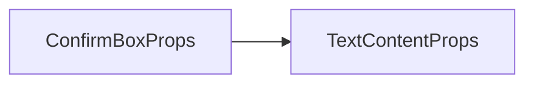

# Choices 选项框组件 API 文档

本文档由 `DeepSeek R1` 模型生成并微调。

---

## 组件特性

-   **多选一机制**：从多个选项中选择一项
-   **自动分页**：通过 `maxHeight` 控制分页
-   **灵活样式**：支持图片背景/纯色背景 + 自定义字体
-   **动态内容**：支持异步加载选项数据

---

## Props 属性说明



本组件完全继承 `TextContent` 组件的参数，参考 [组件 TextContent](./组件%20TextContent.md)

| 属性名      | 类型             | 默认值   | 描述                                  |
| ----------- | ---------------- | -------- | ------------------------------------- |
| `choices`   | `ChoiceItem[]`   | 必填     | 选项数组，格式为 `[key, text]` 的元组 |
| `loc`       | `ElementLocator` | 必填     | 定位配置（需包含 x,y 坐标及锚点）     |
| `width`     | `number`         | 必填     | 选项框宽度（像素）                    |
| `maxHeight` | `number`         | `360`    | 最大高度（超过时自动分页）            |
| `text`      | `string`         | -        | 主说明文本（显示在标题下方）          |
| `title`     | `string`         | -        | 标题文本                              |
| `color`     | `CanvasStyle`    | `#333`   | 背景颜色                              |
| `border`    | `CanvasStyle`    | `gold`   | 边框颜色/样式                         |
| `selFont`   | `Font`           | 系统默认 | 选项文本字体                          |
| `selFill`   | `CanvasStyle`    | `#fff`   | 选项文本颜色                          |
| `titleFont` | `Font`           | 系统默认 | 标题字体                              |
| `titleFill` | `CanvasStyle`    | `gold`   | 标题颜色                              |
| `interval`  | `number`         | `16`     | 选项间垂直间距（像素）                |

---

## Events 事件说明

| 事件名   | 参数             | 触发时机               |
| -------- | ---------------- | ---------------------- |
| `choose` | `key: ChoiceKey` | 用户选择任意选项时触发 |

---

## 使用示例

### 基础用法 - 系统设置

```tsx
import { defineComponent } from 'vue';

export const MyCom = defineComponent(() => {
    const options: ChoiceItem[] = [
        ['low', '低画质'],
        ['medium', '中画质'],
        ['high', '高画质']
    ];

    return () => (
        <Choices
            choices={options}
            loc={[208, 208, void 0, void 0, 0.5, 0.5]}
            width={208}
            title="图形质量设置"
            text="请选择适合您设备的画质等级"
            // key 在这里是每个选项的第一个元素，即 low, medium, high
            onChoose={key => console.log(`Choose ${key}.`)}
        />
    );
});
```

### 分页处理 - 角色选择

```tsx
import { defineComponent } from 'vue';

export const MyCom = defineComponent(() => {
    // 生成 50 个角色选项
    const characters: ChoiceItem[] = Array.from(
        { length: 50 },
        (_, i) => [`char_${i}`, `角色 ${i + 1}`] as ChoiceItem
    );

    return () => (
        <Choices
            choices={characters}
            loc={[208, 208, void 0, void 0, 0.5, 0.5]}
            width={208}
            maxHeight={400} // 高度超过 400px 自动分页
            interval={12}
            // 粗体，20px 大小的 Verdana 字体
            titleFont={new Font('Verdana', 20, 'px', 700)}
            selFill="#4CAF50"
        />
    );
});
```

### 动态内容 + 自定义样式

```tsx
import { defineComponent } from 'vue';
import { onTick } from '@motajs/client';

export const MyCom = defineComponent(() => {
    const dynamicOptions = ref<ChoiceItem[]>([]);

    onTick(() => {
        // 每帧生成随机选项名称
        dynamicOptions.value = Array.from(
            { length: 50 },
            (_, i) =>
                [
                    `char_${i}`,
                    `随机数 ${Math.random().toFixed(8)}`
                ] as ChoiceItem
        );
    });

    return () => (
        <Choices
            choices={dynamicOptions.value}
            loc={[208, 208, void 0, void 0, 0.5, 0.5]}
            width={208}
            color="rgba(30,30,30,0.9)"
            border="#607D8B"
            title="选择随机数"
            titleFill="#B2EBF2"
        />
    );
});
```

---

## 注意事项

1. **选项键值唯一性**  
   每个选项的 `key` 必须唯一，否则可能引发不可预期行为

2. **分页计算规则**  
   分页依据 `maxHeight` 和字体大小自动计算，需确保字体大小一致

3. **使用更方便的函数**：多数情况下，你不需要使用本组件，使用包装好的函数往往会更加方便，参考 [`getChoice`](./functions.md#getchoice)
