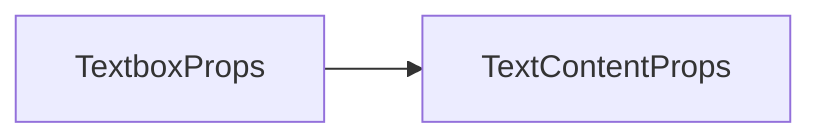
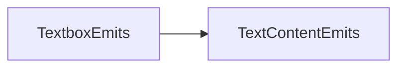
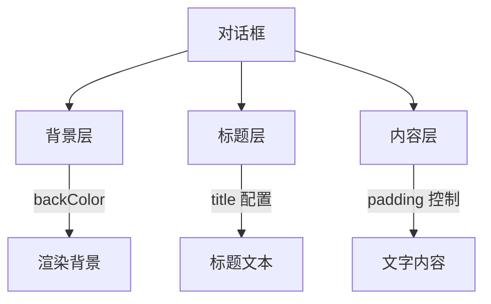

# Textbox 对话框组件 API 文档

本文档由 `DeepSeek R1` 模型生成并微调。

本文档描述在 `TextContent` 基础上扩展的对话框组件，专为剧情对话、系统提示等场景设计，支持背景、标题等装饰元素。

---

## 特有属性说明



| 属性名         | 类型          | 默认值         | 描述                           |
| -------------- | ------------- | -------------- | ------------------------------ |
| `backColor`    | `CanvasStyle` | `#222`         | 背景颜色                       |
| `padding`      | `number`      | `8`            | 内容区域与边框的内边距（像素） |
| `title`        | `string`      | -              | 标题文本内容                   |
| `titleFont`    | `Font`        | `18px Verdana` | 标题字体配置                   |
| `titleFill`    | `CanvasStyle` | `gold`         | 标题文字颜色                   |
| `titleStroke`  | `CanvasStyle` | `transparent`  | 标题描边颜色                   |
| `titlePadding` | `number`      | `8`            | 标题在其背景的间距（像素）     |

---

## 事件说明



完全继承 `TextContent` 的事件。

---

## Exposed Methods 暴露方法

| 方法名    | 参数 | 返回值 | 描述                         |
| --------- | ---- | ------ | ---------------------------- |
| `retype`  | -    | `void` | 从头开始重新打字             |
| `showAll` | -    | `void` | 立刻结束打字机，显示所有文字 |
| `show`    | -    | `void` | 显示这个文本框               |
| `hide`    | -    | `void` | 隐藏这个文本框               |

---

## Slots 插槽说明

### default

背景插槽，传入后可以自定义背景

```tsx
// 例如使用一张图片作为背景
<Textbox>
    <container>
        <image image="myImage.png" />
    </container>
</Textbox>
```

### title

标题背景插槽，自定义标题背景

```tsx
// 与 default 一起使用
<Textbox>
    {{
        // 背景图
        default: () => <image image="myImage.png" />,
        // 标题背景图
        title: () => <g-rectr circle={[4]} fill />
    }}
</Textbox>
```

## 使用示例

### 基础对话框

```tsx
import { defineComponent } from 'vue';

export const MyCom = defineComponent(() => {
    return () => (
        <Textbox
            title="NPC对话"
            padding={12} // 文字内边距
            width={416} // 最大宽度，超过换行，自动减去内边距
            titleFont={new Font('楷体', 22)} // 标题字体
            titleFill="#FFD700" // 标题填充样式
        />
    );
});
```

### 纯色背景 + 复杂标题

```tsx
import { defineComponent } from 'vue';

export const MyCom = defineComponent(() => {
    return () => (
        <Textbox
            title="国王的旨意" // 标题内容
            backColor="rgba(0,0,0,0.8)" // 背景色，使用半透明黑色
            padding={16}
            width={416}
            titlePadding={10} // 标题的内边距
            titleFont={new Font('华文行楷', 24)}
            titleStroke="#8B4513" // 标题描边样式
            titleFill="#FFFFFF"
        />
    );
});
```

### 动态标题交互

```tsx
import { defineComponent } from 'vue';

export const MyCom = defineComponent(() => {
    const currentTitle = ref<string>();

    // 点击按钮切换标题
    const toggleTitle = () => {
        currentTitle.value += 1;
    };

    return () => (
        <container>
            <Textbox
                ref={dialogRef}
                title={currentTitle.value.toString()}
                padding={10}
                width={416}
                titleFill="#FF4444"
            />
            <text text="点击切换标题" onClick={toggleTitle} />
        </container>
    );
});
```

---

## 布局结构示意图


