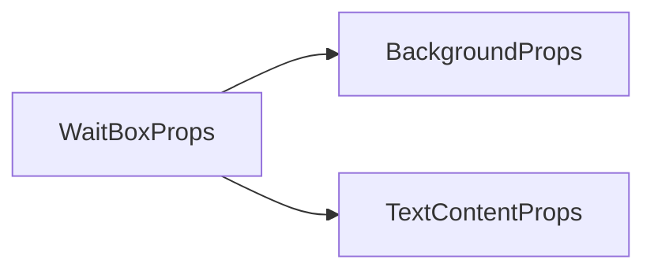

# WaitBox 等待框组件 API 文档

本文档由 `DeepSeek R1` 模型生成并微调。



---

## 核心特性

-   **Promise 绑定**：自动监控 `Promise` 状态
-   **复合式组件**：集成背景+文字+加载动画
-   **双重控制**：支持自动/手动完成等待
-   **动态布局**：根据内容自动计算高度

---

## 组件定位

> 💡 更推荐使用 `waitbox` 工具函数，该组件主要用于需要深度定制的场景。参考 [此文档](./functions.md#waitbox)。

---

## Props 属性说明

| 属性名    | 类型             | 必填 | 描述                    |
| --------- | ---------------- | ---- | ----------------------- |
| `promise` | `Promise<T>`     | 否   | 要监控的 `Promise` 对象 |
| `loc`     | `ElementLocator` | 是   | 容器定位                |
| `width`   | `number`         | 是   | 内容区域宽度（像素）    |
| `text`    | `string`         | 否   | 等待提示文字            |
| `pad`     | `number`         | `16` | 文字与边缘间距          |

### 继承属性

-   支持所有 `Background` 背景属性
-   支持所有 `TextContent` 文本属性

---

## 事件说明

| 事件名    | 参数 | 触发时机                   |
| --------- | ---- | -------------------------- |
| `resolve` | `T`  | `Promise` 完成时返回结果值 |

---

## Exposed Methods 暴露方法

| 方法名    | 参数      | 描述                         |
| --------- | --------- | ---------------------------- |
| `resolve` | `data: T` | 手动完成等待（立即触发事件） |

---

## 使用示例

### 基础组件用法

```tsx
// 等待网络请求
const fetchPromise = fetchData();

<WaitBox
    promise={fetchPromise}
    loc={[208, 208, void 0, void 0, 0.5, 0.5]} // 居中定位
    width={208}
    text="加载中..."
    font={new Font('黑体', 18)}
    onResolve={data => console.log('收到数据:', data)}
/>;
```

### 手动控制示例

```tsx
const waitRef = ref<WaitBoxExpose<number>>();

// 手动结束等待
const forceComplete = () => {
    waitRef.value?.resolve(Date.now());
};

return () => (
    <WaitBox
        ref={waitRef}
        loc={[100, 100, 400, 200]}
        width={360}
        text="点击按钮继续"
        color="rgba(0,0,0,0.7)"
    ></WaitBox>
);
```

---

## 注意事项

1. **推荐用法**  
   多数场景应使用 `waitbox` 函数，以下情况才需要直接使用组件：

    - 需要永久显示的等待界面
    - 需要组合复杂子组件
    - 需要复用同一个等待实例
