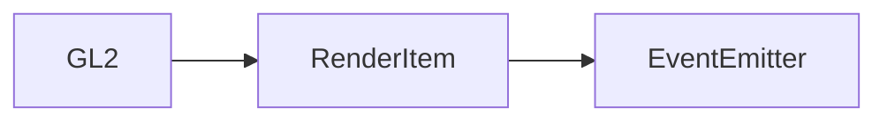

# GL2 类 API 文档

**需丰富**

本文档由 `DeepSeek R1` 模型生成并微调。

## 继承关系



---

## 属性说明

| 属性名                          | 类型                     | 默认值             | 说明                                          |
| ------------------------------- | ------------------------ | ------------------ | --------------------------------------------- |
| `support`                       | `boolean`（静态）        | 检测 WebGL2 支持性 | 标识当前环境是否支持 WebGL2                   |
| `canvas`                        | `HTMLCanvasElement`      | -                  | 绑定的 WebGL2 画布元素                        |
| `gl`                            | `WebGL2RenderingContext` | -                  | WebGL2 渲染上下文                             |
| `UNIFORM_1f` ~ `UNIFORM_4uiv`   | `UniformType` 枚举       | 对应枚举值         | WebGL uniform 类型常量（共 25 种）            |
| `U_MATRIX_2x2` ~ `U_MATRIX_4x4` | `UniformMatrix` 枚举     | 对应枚举值         | 矩阵类型 uniform 常量（9 种）                 |
| `ATTRIB_1f` ~ `ATTRIB_I4uiv`    | `AttribType` 枚举        | 对应枚举值         | 顶点属性类型常量（12 种）                     |
| `MAX_TEXTURE_COUNT`             | `number`                 | `0`                | 最大纹理支持数量（实际值由 WebGL 上下文决定） |

---

## 构造方法

### `constructor`

**参数**

-   `type`: 渲染模式（`absolute` 绝对定位 / `static` 跟随摄像机）

**行为**

-   初始化 WebGL2 上下文
-   自动检测 WebGL2 支持性（通过静态属性 `support`）
-   设置默认渲染模式

---

## 方法说明

### `createProgram`

```typescript
function createProgram<T extends GL2Program>(
    Program: ProgramConstructor<T>,
    vs?: string,
    fs?: string
): T;
```

**描述**  
创建 WebGL 着色器程序  
**参数**

-   `Program`: 着色器程序类（需继承 `GL2Program`）
-   `vs`: 自定义顶点着色器代码（可选）
-   `fs`: 自定义片元着色器代码（可选）  
    **示例**

```typescript
class MyProgram extends GL2Program {}
const program = gl2.createProgram(MyProgram);
```

---

### `useProgram`

```typescript
function useProgram(program: GL2Program): void;
```

**描述**  
切换当前使用的着色器程序  
**示例**

```typescript
gl2.useProgram(shaderProgram);
```

---

### `framebuffer`

```typescript
function framebuffer(
    name: string,
    texture: IShaderTexture2D,
    clear?: boolean
): void;
```

**描述**  
将渲染结果输出到帧缓冲纹理  
**参数**

-   `name`: 帧缓冲名称
-   `texture`: 目标纹理对象
-   `clear`: 是否清空画布

---

### `drawScene`（抽象方法）

```typescript
function drawScene(
    canvas: MotaOffscreenCanvas2D,
    gl: WebGL2RenderingContext,
    program: GL2Program,
    transform: Transform
): void;
```

**描述**  
抽象渲染方法，子类必须实现具体绘制逻辑

---

## 静态方法说明

### `GL2.support`

```typescript
static readonly support: boolean;
```

**描述**  
静态只读属性，检测 WebGL2 支持性  
**示例**

```typescript
if (GL2.support) {
    // 初始化 WebGL2 功能
}
```

---

## 总使用示例

暂时没有。
