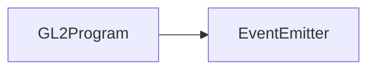

# GL2Program 类 API 文档

**需丰富**

本文档由 `DeepSeek R1` 模型生成并微调。

---

## 继承关系



---

## 属性说明

| 属性名         | 类型                     | 说明                                       |
| -------------- | ------------------------ | ------------------------------------------ |
| `gl`           | `WebGL2RenderingContext` | WebGL2 渲染上下文                          |
| `element`      | `GL2`                    | 关联的 GL2 渲染元素                        |
| `program`      | `WebGLProgram \| null`   | WebGL 着色器程序对象                       |
| `renderMode`   | `RenderMode`             | 当前渲染模式（默认 `RenderMode.Elements`） |
| `usingIndices` | `IShaderIndices \| null` | 当前使用的顶点索引数组                     |

---

## 方法说明

### `defineUniform`

```typescript
function defineUniform<T extends UniformType>(
    uniform: string,
    type: T
): IShaderUniform<T> | null;
```

**描述**  
定义 Uniform 变量  
**参数**

-   `uniform`: Uniform 变量名
-   `type`: Uniform 类型（如 `GL2.UNIFORM_2f`）  
    **返回值**
-   操作对象（可设置值）或 `null`（定义失败）

---

### `defineTexture`

```typescript
function defineTexture(
    name: string,
    index: number,
    w?: number,
    h?: number
): IShaderTexture2D | null;
```

**描述**  
定义纹理对象  
**参数**

-   `name`: 纹理名称
-   `index`: 纹理索引（建议不超过 8）
-   `w`: 纹理宽度（可选）
-   `h`: 纹理高度（可选）  
    **示例**

```typescript
const tex = program.defineTexture('diffuse', 0, 512, 512);
```

---

### `paramElements`

```typescript
function paramElements(
    mode: GLenum,
    count: number,
    type: GLenum,
    offset: number
): void;
```

**描述**  
设置元素模式渲染参数  
**参数**

-   `mode`: 渲染模式（如 `gl.TRIANGLES`）
-   `count`: 元素数量
-   `type`: 数据类型（如 `gl.UNSIGNED_SHORT`）
-   `offset`: 数据偏移量

---

### `requestCompile`

```typescript
function requestCompile(force?: boolean): boolean;
```

**描述**  
请求编译着色器  
**参数**

-   `force`: 是否强制重新编译  
    **返回值**
-   `true` 表示编译成功

---

### `vs`

```typescript
function vs(vs: string): void;
```

**描述**  
设置顶点着色器代码  
**示例**

```typescript
program.vs(`
    ${GL2_PREFIX.VERTEX}
    in vec4 aPosition;
    void main() {
        gl_Position = aPosition;
    }
`);
```

---

## 事件说明

| 事件名   | 触发时机         | 参数类型 |
| -------- | ---------------- | -------- |
| `load`   | 程序被加载使用时 | `[]`     |
| `unload` | 程序被卸载时     | `[]`     |

---

## 总使用示例

```typescript
// 创建着色器程序
const program = gl2.createProgram(GL2Program);

// 定义着色器
program.vs(`
    ${GL2_PREFIX.VERTEX}
    uniform mat4 uProjection;
    in vec4 aPosition;
    void main() {
        gl_Position = uProjection * aPosition;
    }
`);

program.fs(`
    ${GL2_PREFIX.FRAGMENT}
    out vec4 fragColor;
    uniform vec3 uColor;
    void main() {
        fragColor = vec4(uColor, 1.0);
    }
`);

// 定义 Uniform 和纹理
const colorUniform = program.defineUniform('uColor', UniformType.Uniform3f);
const diffuseTex = program.defineTexture('diffuse', 0, 512, 512);

// 设置渲染参数
program.paramElements(gl.TRIANGLES, 6, gl.UNSIGNED_SHORT, 0);

// 编译并应用
if (program.requestCompile()) {
    gl2.useProgram(program);
    colorUniform?.set(1.0, 0.5, 0.2);
    diffuseTex?.set(imageElement);
}
```
