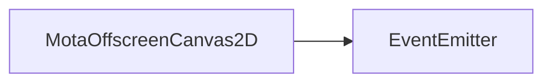

# MotaOffscreenCanvas2D 类 API 文档

以下内容由 `DeepSeek R1` 模型生成并微调。

---

## 继承关系



---

## 属性说明

| 属性名           | 类型                       | 默认值   | 说明                                       |
| ---------------- | -------------------------- | -------- | ------------------------------------------ |
| `canvas`         | `HTMLCanvasElement`        | -        | 关联的 HTML 画布元素                       |
| `ctx`            | `CanvasRenderingContext2D` | -        | 画布的 2D 渲染上下文                       |
| `width`          | `number`                   | 自动计算 | 画布的逻辑宽度（不包含缩放比例）           |
| `height`         | `number`                   | 自动计算 | 画布的逻辑高度（不包含缩放比例）           |
| `highResolution` | `boolean`                  | `true`   | 是否启用高清画布（根据设备像素比例缩放）   |
| `antiAliasing`   | `boolean`                  | `true`   | 是否启用抗锯齿                             |
| `scale`          | `number`                   | `1`      | 当前画布的缩放比例                         |
| `symbol`         | `number`                   | `0`      | 更新标识符，值变化表示画布被被动清空或调整 |

---

## 构造方法

### `constructor`

```ts
function constructor(
    alpha: boolean = true,
    canvas?: HTMLCanvasElement
): MotaOffscreenCanvas2D;
```

**描述**  
创建一个新的离屏画布。  
**参数**

-   `alpha`: 是否启用透明度通道（默认为 `true`）。
-   `canvas`: 可指定现有画布，未提供时自动创建新画布。  
    **注意**
-   在自定义渲染元素中，建议使用 `RenderItem.requireCanvas` 而非直接调用此构造函数。

---

## 方法说明

### `setScale`

```ts
function setScale(scale: number): void;
```

**描述**
设置画布的缩放比例。
**参数**

-   `scale`: 缩放比。

### `size`

```ts
function size(width: number, height: number): void;
```

**描述**  
设置画布的尺寸。  
**参数**

-   `width`: 逻辑宽度（最小为 1）。
-   `height`: 逻辑高度（最小为 1）。  
    **行为**
-   自动计算缩放比例（考虑 `highResolution` 和 `autoScale`）。
-   调整画布物理尺寸和样式尺寸。

**示例**

```typescript
const canvas = new MotaOffscreenCanvas2D();
canvas.size(800, 600); // 设置画布尺寸为 800x600（逻辑尺寸）
```

---

### `setHD`

```ts
function setHD(hd: boolean): void;
```

**描述**  
设置是否为高清画布（基于设备像素比例）。  
**参数**

-   `hd`: 是否启用高清模式。

**示例**

```typescript
canvas.setHD(false); // 关闭高清模式
```

---

### `setAntiAliasing`

```ts
function setAntiAliasing(anti: boolean): void;
```

**描述**  
设置抗锯齿功能。  
**参数**

-   `anti`: 是否启用抗锯齿。

**示例**

```typescript
canvas.setAntiAliasing(false); // 关闭抗锯齿
```

---

### `clear`

```ts
function clear(): void;
```

**描述**  
清空画布内容。  
**注意**

-   冻结状态下调用此方法会触发警告。

**示例**

```typescript
canvas.clear(); // 清空画布
```

---

## 静态方法说明

### `MotaOffscreenCanvas2D.clone`

```ts
function clone(canvas: MotaOffscreenCanvas2D): MotaOffscreenCanvas2D;
```

**描述**  
复制一个画布对象。  
**返回值**

-   复制的画布对象。

**示例**

```typescript
const cloned = MotaOffscreenCanvas2D.clone(sourceCanvas); // 复制画布
```

---

## 事件类型

### `resize`

**触发时机**  
当画布被动调整尺寸时触发（例如窗口大小变化或 `core.domStyle.scale` 变化）。

**监听示例**

```typescript
canvas.on('resize', () => {
    console.log('画布尺寸已调整');
});
```

---

## 使用示例

```typescript
// 创建画布
const canvas = new MotaOffscreenCanvas2D();

// 配置属性
canvas.size(800, 600);
canvas.setHD(true);

// 监听调整事件
canvas.on('resize', () => {
    console.log('画布尺寸已更新');
});

// 绘制内容
canvas.ctx.fillStyle = 'red';
canvas.ctx.fillRect(0, 0, canvas.width, canvas.height);

// 复制画布
const cloned = MotaOffscreenCanvas2D.clone(canvas);
```
