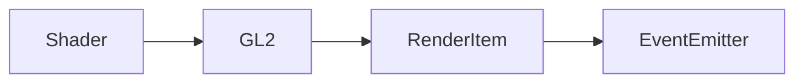

# Shader 类 API 文档

```mermaid
graph LR
    Shader --> GL2 --> RenderItem --> EventEmitter

    click GL2 "./GL2"
    click RenderItem "./RenderItem"
    click EventEmitter "https://nodejs.org/api/events.html#class-eventemitter"
```

用法同 [GL2](./GL2.md)
