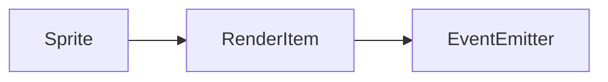

# Sprite 类 API 文档

本文档由 `DeepSeek R1` 模型生成并微调。

---

## 继承关系



---

## 属性说明

| 属性名     | 类型             | 默认值     | 说明                                   |
| ---------- | ---------------- | ---------- | -------------------------------------- |
| `renderFn` | `RenderFunction` | `() => {}` | 自定义渲染函数，用于定义精灵的绘制逻辑 |

---

## 构造方法

### `constructor`

**参数**

-   `type`: 渲染模式（`absolute` 绝对定位 / `static` 跟随摄像机）
-   `cache`: 是否启用渲染缓存（默认启用）
-   `fall`: 是否启用变换矩阵下穿机制（默认关闭）

**示例**

```typescript
const sprite = new Sprite('static');
```

---

## 方法说明

### `setRenderFn`

```typescript
function setRenderFn(fn: RenderFunction): void;
```

**描述**  
设置自定义渲染函数，用于定义精灵的具体绘制逻辑。  
**参数**

-   `fn`: 接收画布和变换矩阵的回调函数，格式为 `(canvas, transform) => void`

**示例**

```typescript
sprite.setRenderFn((canvas, transform) => {
    // 绘制一个红色矩形
    canvas.ctx.fillStyle = 'red';
    canvas.ctx.fillRect(0, 0, sprite.width, sprite.height);
});
```

---

## 总使用示例

```typescript
// 创建精灵实例
const sprite = new Sprite('absolute');
sprite.size(100, 100); // 设置尺寸
sprite.pos(200, 150); // 设置坐标

// 定义渲染逻辑
sprite.setRenderFn(canvas => {
    const ctx = canvas.ctx;
    // 绘制渐变圆形
    const gradient = ctx.createRadialGradient(50, 50, 0, 50, 50, 50);
    gradient.addColorStop(0, 'yellow');
    gradient.addColorStop(1, 'orange');
    ctx.fillStyle = gradient;
    ctx.beginPath();
    ctx.arc(50, 50, 50, 0, Math.PI * 2);
    ctx.fill();
});

// 添加到父容器
container.appendChild(sprite);

// 监听变换事件
sprite.on('transform', (item, transform) => {
    console.log('精灵变换矩阵更新:', transform);
});
```

---

## 高级用法示例

```typescript
// 创建动态旋转精灵
const rotatingSprite = new Sprite('static');
rotatingSprite.size(80, 80);
rotatingSprite.setRenderFn((canvas, transform) => {
    canvas.ctx.fillStyle = 'blue';
    canvas.ctx.fillRect(0, 0, 80, 80);
});

// 每帧旋转
rotatingSprite.delegateTicker(time => {
    rotatingSprite.transform.setRotate(time / 1000);
});

// 添加到场景
rootContainer.appendChild(rotatingSprite);
```
