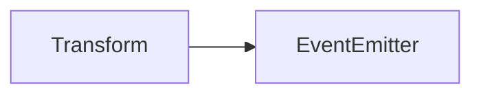

# Transform 类 API 文档

以下内容由 `DeepSeek R1` 模型生成并微调。

---

## 继承关系



---

## 属性说明

| 属性名         | 类型                  | 默认值      | 说明                                                        |
| -------------- | --------------------- | ----------- | ----------------------------------------------------------- |
| `mat`          | `mat3`                | 单位矩阵    | 存储当前变换的 3x3 矩阵                                     |
| `x`            | `number`              | `0`         | 水平平移量                                                  |
| `y`            | `number`              | `0`         | 垂直平移量                                                  |
| `scaleX`       | `number`              | `1`         | 水平缩放比例                                                |
| `scaleY`       | `number`              | `1`         | 垂直缩放比例                                                |
| `rad`          | `number`              | `0`         | 旋转弧度值（范围：`[0, 2π)`）                               |
| `modified`     | `boolean`（私有）     | `false`     | 标识变换是否被修改过                                        |
| `bindedObject` | `ITransformUpdatable` | `undefined` | 绑定的对象（当变换更新时自动调用其 `updateTransform` 方法） |

---

## 构造方法

### `constructor`

创建一个新的变换实例，初始化为单位矩阵。

```typescript
const transform = new Transform();
```

---

## 方法说明

### `bind`

```typescript
function bind(obj?: ITransformUpdatable): void;
```

**描述**  
绑定一个对象，当变换更新时自动调用其 `updateTransform` 方法（若存在）。

**示例**

```typescript
const obj = { updateTransform: () => console.log('Transform updated!') };
transform.bind(obj);
```

---

### `reset`

```typescript
function reset(): void;
```

**描述**  
重置所有参数到初始状态（单位矩阵）。

**示例**

```typescript
transform.reset(); // 重置为 x=0, y=0, scaleX=1, scaleY=1, rad=0
```

---

### `scale`

```typescript
function scale(x: number, y: number = x): this;
```

**描述**  
叠加缩放变换（相对于当前状态）。

**参数**

-   `x`: 水平缩放比例
-   `y`: 垂直缩放比例（默认同 `x`）

**示例**

```typescript
transform.scale(2); // 水平和垂直均放大2倍
transform.scale(1.5, 0.5); // 水平放大1.5倍，垂直缩小到0.5倍
```

---

### `translate`

```typescript
function translate(x: number, y: number): this;
```

**描述**  
叠加平移变换（相对于当前状态）。

**参数**

-   `x`: 水平平移量
-   `y`: 垂直平移量

**示例**

```typescript
transform.translate(100, 50); // 向右平移100单位，向下平移50单位
```

---

### `rotate`

```typescript
function rotate(rad: number): this;
```

**描述**  
叠加旋转变换（相对于当前状态）。

**参数**

-   `rad`: 旋转弧度值

**示例**

```typescript
transform.rotate(Math.PI / 2); // 顺时针旋转90度
```

---

### `setScale`

```typescript
function setScale(x: number, y: number = x): this;
```

**描述**  
直接设置缩放比例（非叠加，覆盖当前状态）。

**示例**

```typescript
transform.setScale(3, 2); // 设置水平缩放3倍，垂直缩放2倍
```

---

### `setTranslate`

```typescript
function setTranslate(x: number, y: number): this;
```

**描述**  
直接设置平移量（非叠加，覆盖当前状态）。

**示例**

```typescript
transform.setTranslate(200, 100); // 直接定位到(200, 100)
```

---

### `setRotate`

```typescript
function setRotate(rad: number): this;
```

**描述**  
直接设置旋转角度（非叠加，覆盖当前状态）。

**示例**

```typescript
transform.setRotate(Math.PI); // 设置旋转180度
```

---

### `transformed`

```typescript
function transformed(x: number, y: number): vec3;
```

**描述**  
将坐标点 `(x, y)` 应用当前变换矩阵，返回变换后的坐标。

**返回值**

-   `vec3`: 变换后的三维坐标（`[x, y, 1]`）

**示例**

```typescript
const point = transform.transformed(10, 20); // 应用变换后的坐标
```

---

### `untransformed`

```typescript
function untransformed(x: number, y: number): vec3;
```

**描述**  
将坐标点 `(x, y)` 逆向应用当前变换矩阵，返回原坐标。

**示例**

```typescript
const origin = transform.untransformed(50, 30); // 逆向变换后的坐标
```

---

### `clone`

```typescript
function clone(): Transform;
```

**描述**  
复制当前变换实例。

**示例**

```typescript
const cloned = transform.clone(); // 生成一个完全相同的副本
```

---

## 静态方法说明

### `Transform.transformed`

```typescript
function transformed(transform: Transform, x: number, y: number): vec3;
```

**描述**  
静态方法，直接通过变换矩阵计算坐标点 `(x, y)` 的变换结果。

**示例**

```typescript
const result = Transform.transformed(transform, 5, 5);
```

---

### `Transform.untransformed`

```typescript
function untransformed(transform: Transform, x: number, y: number): vec3;
```

**描述**  
静态方法，直接通过变换矩阵逆向计算坐标点 `(x, y)` 的原位置。

**示例**

```typescript
const origin = Transform.untransformed(transform, 100, 50);
```

---

## 接口说明

### `ITransformUpdatable`

```typescript
interface ITransformUpdatable {
    updateTransform?(): void;
}
```

**描述**  
可绑定对象的接口，当变换更新时触发 `updateTransform` 方法（可选）。

---

## 总使用示例

```typescript
// 创建变换实例
const transform = new Transform();

// 应用变换
transform
    .translate(50, 30)
    .scale(2)
    .rotate(Math.PI / 4);

// 绑定对象
const obj = {
    updateTransform: () => console.log('Transform updated!')
};
transform.bind(obj);

// 坐标转换
const transformedPoint = transform.transformed(10, 10);
console.log('Transformed point:', transformedPoint);

// 复制变换
const cloned = transform.clone();

// 静态方法使用
const staticResult = Transform.transformed(cloned, 5, 5);
```
