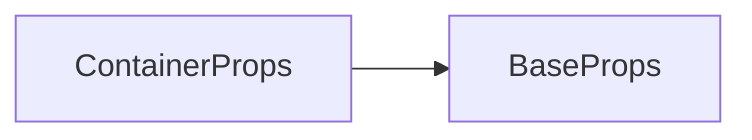

# ContainerProps API 文档

本文档由 `DeepSeek R1` 模型生成并微调。

---



---

## 接口定义

```typescript
interface ContainerProps extends BaseProps {} // 无新增属性，完全继承 BaseProps
```

---

## 核心能力

1. **嵌套结构**：支持多层容器嵌套，构建复杂 UI 层级
2. **批量更新**：通过容器隔离高频/低频更新内容
3. **虚拟化支持**：推荐结合 `Scroll`/`Page` 组件处理大数据量场景

---

## 完整示例集

### 示例 1：基础容器（静态内容优化）

```tsx
import { ref } from 'vue';
import { Font } from '@motajs/render-style';

const count = ref(0);
const boldFont = new Font('Verdana', 18, 'px', 700);

// 静态容器（启用缓存）
<container cache loc={[0, 0, 200, 200]}>
    {/* 静态背景 */}
    <sprite />

    {/* 动态计数器 */}
    <container x={100} y={100}>
        <text text={count.value.toString()} font={boldFont} />
    </container>
</container>;
```

**优化策略**：

-   背景层缓存，避免重复绘制
-   计数器单独放置在独立容器，避免高频内容污染致使低频内容也需要高频更新

---

### 示例 2：条件渲染 + 循环渲染

```tsx
import { ref } from 'vue';

// 根据状态显示不同内容
const tab = ref<'list' | 'detail'>('list');

const item = [{ id: 0, name: '第一个元素' }];

return () => (
    <container>
        {/* 选项卡导航 */}
        <container x={20} y={20}>
            <text text="列表" />
            <text text="详情" />
        </container>

        {/* 条件内容区 */}
        {tab === 'list' ? (
            {/* 循环渲染 */}
            <container cache={true} y={60}>
                {items.map((item, i) => (
                    <text key={item.id} x={0} y={i * 40} text={`列表元素${item.name}`} />
                ))}
            </container>
        ) : (
            <container y={60}>
                <text text="详情内容" />
            </container>
        )}
    </container>
);
```

---

### 示例 3：动态布局嵌套

```tsx
// 自适应居中布局
<container anc={[0.5, 0.5]} loc={[0, 0, 200, 200]}>
    {/* 主内容卡片 */}
    <container>
        <text x={20} y={20} text="自适应内容" />
    </container>

    {/* 控制栏 */}
    <container loc={[20, 20, 200, 40]}>
        <text text="控制栏" />
    </container>
</container>
```

---

## 性能优化指南

### 缓存策略对比

| 场景             | 配置           | 重绘频率 | 适用场景        |
| ---------------- | -------------- | -------- | --------------- |
| 不频繁更新的内容 | `cache=true`   | 偶尔重绘 | 背景/图标等     |
| 高频更新内容     | `nocache=true` | 每帧重绘 | 动画/计数器     |
| 混合内容         | 分层容器       | 按需更新 | 带静态背景的 UI |

### 大数据量处理方案

考虑使用[滚动条](../user-client-modules/Scroll.md)或[分页](../user-client-modules/Page.md)组件。

---

## 注意事项

1. **缓存失效条件**：当任意子元素及自身发生变化时，将会自动触发更新
2. **嵌套层级**：推荐使用容器嵌套提高缓存能力，但是并建议不嵌套过多
3. **子元素更新**：修改容器子元素时会触发整个容器的缓存重建
4. **内存管理**：超大缓存容器（如 4096x4096）可能触发浏览器纹理限制
