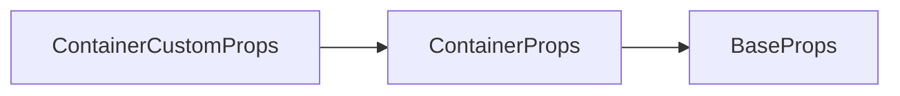

# ContainerCustomProps API 文档

本文档由 `DeepSeek R1` 模型生成并微调。

---



---

## 接口定义

```typescript
interface ContainerCustomProps extends ContainerProps {
    /**
     * 自定义容器渲染函数
     * @param canvas - 离屏画布对象（已应用容器的变换矩阵）
     * @param children - 所有子元素（未经过滤，按照 zIndex 从小到大排列）
     * @param transform - 容器自身相对于父元素的变换矩阵
     */
    render?: (
        canvas: MotaOffscreenCanvas2D,
        children: RenderItem[],
        transform: Transform
    ) => void;
}
```

---

## 核心能力

1. **虚拟化渲染**：通过自定义筛选逻辑实现仅渲染想要渲染的内容
2. **渲染劫持**：完全接管子元素的绘制流程

---

## 完整示例集

### 示例 1：默认渲染模式（等同普通容器）

```tsx
// 不传 render 参数时，自动渲染全部子元素
<container-custom>
    <sprite x={0} render={drawBackground} />
    <text x={20} y={20} text="Default Render" />
    <text x={200} text="Click Me" />
</container-custom>
```

---

### 示例 2：部分渲染（仅显示可见区域）

```tsx
const render = (
    canvas: MotaOffscreenCanvas2D,
    children: RenderItem[],
    transform: Transform
) => {
    // 在 [0, 0, 200, 200] 之外的内容不渲染
    children.forEach(child => {
        const rect = child.getBoundingRect();
        // 不在范围内的排除
        if (
            rect.right < 0 ||
            rect.bottom < 0 ||
            rect.left > 200 ||
            rect.top > 200
        )
            return;
        child.renderContent(canvas, transform);
    });
};

<container-custom render={render}>
    {/* 循环渲染 */}
    {items.map((item, i) => (
        <sprite x={i * 60} y={0} />
    ))}
</container-custom>;
```
