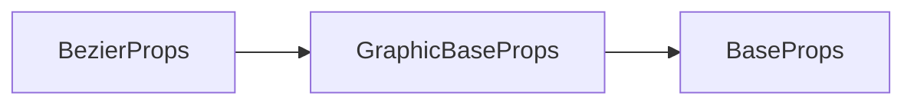

# g-bezier 标签 API 文档

本文档由 `DeepSeek R1` 模型生成并微调。

---



---

## 接口定义

```typescript
interface BezierProps extends GraphicBaseProps {
    sx?: number; // 起点X坐标
    sy?: number; // 起点Y坐标
    cp1x?: number; // 第一控制点X坐标
    cp1y?: number; // 第一控制点Y坐标
    cp2x?: number; // 第二控制点X坐标
    cp2y?: number; // 第二控制点Y坐标
    ex?: number; // 终点X坐标
    ey?: number; // 终点Y坐标
    curve?: BezierParams; // 简写属性 [sx, sy, cp1x, cp1y, cp2x, cp2y, ex, ey]
}
```

---

## 核心属性说明

| 属性    | 类型                                       | 默认值 | 说明                                  |
| ------- | ------------------------------------------ | ------ | ------------------------------------- |
| `sx`    | `number`                                   | -      | 曲线起点 X 坐标（单位：像素）         |
| `sy`    | `number`                                   | -      | 曲线起点 Y 坐标（单位：像素）         |
| `cp1x`  | `number`                                   | -      | 第一控制点 X 坐标（影响曲线起始方向） |
| `cp1y`  | `number`                                   | -      | 第一控制点 Y 坐标                     |
| `cp2x`  | `number`                                   | -      | 第二控制点 X 坐标（影响曲线结束方向） |
| `cp2y`  | `number`                                   | -      | 第二控制点 Y 坐标                     |
| `ex`    | `number`                                   | -      | 曲线终点 X 坐标                       |
| `ey`    | `number`                                   | -      | 曲线终点 Y 坐标                       |
| `curve` | `[sx, sy, cp1x, cp1y, cp2x, cp2y, ex, ey]` | -      | 简写属性：一次性定义全部坐标点        |

---

## 完整示例集

### 示例 1：基础三次贝塞尔曲线

```tsx
// 曲线默认仅描边，不需要单独设置 stroke 属性
<g-bezier
    sx={100} // 起点 (100, 300)
    sy={300}
    cp1x={200} // 第一控制点 (200, 100)
    cp1y={100}
    cp2x={400} // 第二控制点 (400, 500)
    cp2y={500}
    ex={500} // 终点 (500, 300)
    ey={300}
    strokeStyle="#e74c3c"
    strokeWidth={3}
/>
```

---

### 示例 2：虚线波浪线

```tsx
<g-bezier
    curve={[50, 200, 150, 50, 250, 350, 350, 200]} // 简写属性定义
    stroke={true}
    strokeStyle="#3498db"
    strokeWidth={2}
    lineDash={[10, 5]} // 虚线样式
    lineCap="round" // 圆角端点
/>
```

**曲线形态**：

-   起点 (50,200) → 第一控制点 (150,50)
-   第二控制点 (250,350) → 终点 (350,200)
-   形成"S"型波浪线

---

### 示例 3：动态流体效果

```tsx
import { ref } from 'vue';

const offset = ref(0);

// 每帧更新控制点位置
onTick(() => {
    offset.value += 0.02;
});

<g-bezier
    sx={100}
    sy={400}
    cp1x={200 + Math.sin(offset.value) * 30} // 水平波动
    cp1y={300 + Math.cos(offset.value) * 50} // 垂直波动
    cp2x={400}
    cp2y={500}
    ex={500}
    ey={400}
    strokeStyle={`hsl(${offset * 50}, 70%, 50%)`} // 变化的颜色
    strokeWidth={4}
/>;
```

---

## 控制点行为说明

### 控制点影响示意图

```typescript
/*
         (cp1)  
          ▲  
          |  
(start)●━━╋━━━━━━━━━━━┓  
          ┃           ┃  
          ┃    (cp2)  ┃  
          ┃      ▼    ┃  
          ┗━━━━━━━●━━(end)
*/
```

-   **第一控制点** (`cp1`)：控制曲线起始方向的弯曲程度
-   **第二控制点** (`cp2`)：控制曲线结束方向的弯曲程度

### 特殊形态案例

| 控制点布局                           | 曲线形态描述      |
| ------------------------------------ | ----------------- |
| `cp1`靠近起点，`cp2`靠近终点         | 近似直线          |
| `cp1`与`cp2`对称分布                 | 形成对称波浪      |
| `cp1`在起点正上方，`cp2`在终点正下方 | 创建垂直"S"型曲线 |

---

## 高级用法示例

### 复杂路径组合

```tsx
// 组合多条贝塞尔曲线形成花瓣造型
<container x={400} y={300}>
    {Array.from({ length: 5 }).map((_, i) => (
        <g-bezier
            key={i}
            curve={[
                0,
                0, // 起点（中心）
                Math.cos(angle) * 80, // cp1（外层控制点）
                Math.sin(angle) * 80,
                Math.cos(angle + Math.PI / 5) * 120, // cp2（花瓣尖端控制点）
                Math.sin(angle + Math.PI / 5) * 120,
                Math.cos(angle + Math.PI / 2.5) * 80, // 终点（对称点）
                Math.sin(angle + Math.PI / 2.5) * 80
            ]}
            fill
            stroke
            strokeStyle="#e84393"
            fillStyle="rgba(232,67,147,0.3)"
            rotate={((Math.PI * 2) / 5) * i} // 旋转复制
        />
    ))}
</container>
```

---

## 注意事项

1. **闭合路径**：  
   三次贝塞尔曲线默认不闭合，如需闭合需手动连接到起点：

```tsx
<g-bezier
    curve={[100, 100, 200, 50, 300, 150, 100, 100]} // 终点回到起点
    fill // 自动闭合填充
/>
```

2. **控制点极值**：  
   当控制点距离起点/终点过远时可能产生剧烈弯曲：

```tsx
// 可能产生非预期锐角
<g-bezier cp1x={sx + 500} .../>
```
