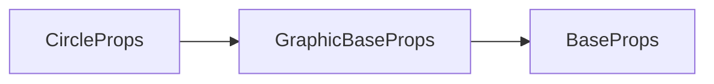

# g-circle 标签 API 文档

本文档由 `DeepSeek R1` 模型生成并微调。

---



---

## 接口定义

```typescript
interface CircleProps extends GraphicBaseProps {
    radius?: number; // 圆的半径
    start?: number; // 起始角度（单位：弧度）
    end?: number; // 结束角度（单位：弧度）
    circle?: CircleParams; // 简写属性 [x, y, radius, start?, end?]，后两项要么都填，要么都不填
}
```

---

## 核心属性说明

| 属性     | 类型                      | 默认值 | 说明                                                       |
| -------- | ------------------------- | ------ | ---------------------------------------------------------- |
| `radius` | `number`                  | -      | 圆的半径（单位：像素）                                     |
| `start`  | `number`                  | `0`    | 起始角度（弧度），0 弧度 = 3 点钟方向（水平向右）          |
| `end`    | `number`                  | `2π`   | 结束角度（弧度），默认完整圆                               |
| `circle` | `[x, y, r, start?, end?]` | -      | 简写属性：<br>`[圆心x, 圆心y, 半径, 起始角度?, 结束角度?]` |

---

## 完整示例集

### 示例 1：基础圆形（填充）

```tsx
<g-circle
    x={100} // 圆心x坐标
    y={100} // 圆心y坐标
    radius={50} // 半径50px
    fill // 启用填充
    fillStyle="#ff7675" // 珊瑚红色
/>
```

---

### 示例 2：描边圆形

```tsx
<g-circle
    circle={[300, 200, 60]} // 简写属性 [x,y,radius]
    stroke // 启用描边
    strokeStyle="#0984e3" // 蓝色描边
    strokeWidth={5} // 5px宽描边
/>
```

---

### 示例 3：弓形（填充闭合）

```tsx
<g-circle
    // 起始角度：90度（12点钟方向） 结束角度：180度（9点钟方向）
    circle={[500, 300, 80, Math.PI / 2, Math.PI]}
    fill
    fillStyle="#55efc4" // 薄荷绿填充
/>
```

**角度说明**：

-   绘制方向：**顺时针**（从 12 点走向 9 点）
-   自动闭合路径形成扇形

---

### 示例 4：圆弧（非闭合）

```tsx
<g-circle
    circle={[200, 400, 70, Math.PI / 4, Math.PI * 1.5]} // [x,y,r,start,end]
    stroke // 仅描边
    strokeStyle="#d63031" // 红色描边
    strokeWidth={3}
/>
```

**路径特征**：

-   起始角度：45 度（右上对角线方向）
-   结束角度：270 度（12 点钟方向）
-   开环不闭合，形成月牙形弧线

---

## 角度系统详解

### 坐标系与方向

```typescript
// 0弧度基准点与绘制方向示意图
/*
          Math.PI / 2 (90°)
                 |
                 |
Math.PI (180°) ——+—— 0 (0°)
                 |
                 |
       Math.PI * 3 / 2 (270°)
*/
```

-   **0 弧度基准**：3 点钟方向（与浏览器 Canvas API 完全一致）
-   **绘制方向**：角度递增为顺时针方向（`start=0, end=Math.PI/2` 绘制右下四分之一圆）

### 特殊角度对照表

| 弧度值        | 角度值 | 方向   |
| ------------- | ------ | ------ |
| `0`           | 0°     | 正右 → |
| `Math.PI/2`   | 90°    | 正上 ↑ |
| `Math.PI`     | 180°   | 正左 ← |
| `3*Math.PI/2` | 270°   | 正下 ↓ |

---

## 高级用法示例

### 动态进度环

```tsx
import { ref } from 'vue';
import { onTick } from '@motajs/render-vue';

const progress = ref(0);

// 每帧更新进度
onTick(() => {
    progress.value += 0.01;
});

<g-circle
    circle={[400, 400, 100]}
    start={-Math.PI / 2} // 从12点开始
    end={-Math.PI / 2 + progress.value * Math.PI * 2} // 顺时针增长
    stroke
    strokeStyle="#00b894"
    strokeWidth={15}
    lineCap="round" // 圆角端点
/>;
```

**效果**：

-   0%时从顶部开始
-   进度条顺时针增长
-   圆角端点消除锯齿

---

## 注意事项

1. **简写属性优先级**：

```tsx
// 谁最后设置用谁的
<g-circle
    x={100} // 被覆盖
    circle={[200, 300, 50]} // 实际生效坐标 (200,300)
/>
```
