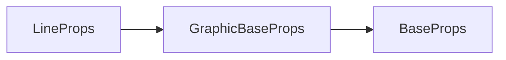

# g-line 标签 API 文档

本文档由 `DeepSeek R1` 模型生成并微调。

---



---

## 接口定义

```typescript
interface LineProps extends GraphicBaseProps {
    x1?: number; // 起点X坐标
    y1?: number; // 起点Y坐标
    x2?: number; // 终点X坐标
    y2?: number; // 终点Y坐标
    line?: LineParams; // 简写属性 [x1, y1, x2, y2]
}
```

---

## 核心属性说明

| 属性       | 类型                                | 默认值   | 说明                                           |
| ---------- | ----------------------------------- | -------- | ---------------------------------------------- |
| `x1`       | `number`                            | -        | 线段起点 X 坐标（单位：像素）                  |
| `y1`       | `number`                            | -        | 线段起点 Y 坐标（单位：像素）                  |
| `x2`       | `number`                            | -        | 线段终点 X 坐标（单位：像素）                  |
| `y2`       | `number`                            | -        | 线段终点 Y 坐标（单位：像素）                  |
| `line`     | `[x1, y1, x2, y2]`                  | -        | 简写属性：一次性定义起点和终点坐标             |
| `lineDash` | `number[]`                          | -        | 虚线模式（如 `[5, 3]` 表示 5px 实线+3px 间隙） |
| `lineCap`  | `"butt"` \| `"round"` \| `"square"` | `"butt"` | 线段端点样式                                   |

---

## 完整示例集

### 示例 1：基础实线

```tsx
// 线段默认就是仅描边，因此不需要单独设置 stroke 属性
<g-line
    line={[100, 50, 300, 50]} // 起点坐标 (100, 50) 终点坐标 (300, 50)
    strokeStyle="#2d98da" // 蓝色
    strokeWidth={3} // 3px宽度
/>
```

---

### 示例 2：虚线线段

```tsx
<g-line
    line={[50, 150, 400, 150]} // 简写属性定义起点终点
    strokeStyle="#eb3b5a" // 红色
    strokeWidth={2}
    lineDash={[10, 5]} // 10px实线 + 5px间隙
    lineCap="round" // 圆角端点
/>
```

**效果说明**：

-   水平红色虚线
-   线段端点呈圆形

---

### 示例 3：动态线段（动画）

```tsx
import { transitioned } from '@user/client-modules';

// 创建渐变
const x2 = transitioned(100, 2000, linear());
x2.set(400); // 终点横坐标从 100 变到 400

return () => (
    <g-line
        line={[100, 300, x2.ref.value, 300]}
        strokeStyle="#10ac84"
        strokeWidth={4}
    />
);
```

**动态效果**：

-   线段从 100px 位置向右延伸至 400px
-   2 秒完成动画

---

## 线段样式对照表

| 样式组合              | 效果图示          |
| --------------------- | ----------------- |
| `lineCap="butt"`      | 平头端点：⎯       |
| `lineCap="round"`     | 圆头端点：⭘―――――⭘ |
| `lineCap="square"`    | 方头端点：▯―――――▯ |
| `lineDash=[20,5,5,5]` | 复杂虚线：━━⧀┄⧀┄  |

---

## 注意事项

1. **坐标系差异**：  
   线段坐标基于父容器坐标系，如需相对定位建议嵌套在`container`中：

```tsx
<container x={100} y={100}>
    {/* 实际坐标为 (100,100)→(150,150) */}
    <g-line line={[0, 0, 50, 50]} />
</container>
```
