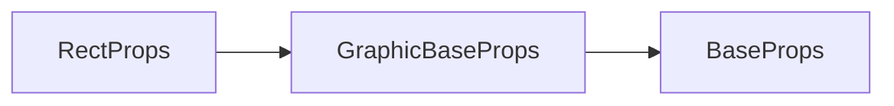

# g-rect 标签 API 文档

本文档由 `DeepSeek R1` 模型生成并微调。

---



---

## 使用示例

### 示例 1：仅填充模式

```tsx
<g-rect
    loc={[100, 100, 200, 150]} // x,y,width,height
    fill
    fillStyle="#fff"
/>
```

**效果**：

-   200x150 矩形
-   无描边效果

---

### 示例 2：仅描边模式

```tsx
<g-rect
    loc={[400, 200, 180, 120]}
    stroke
    strokeStyle="rgba(0,0,0,0.8)"
    strokeWidth={4}
    actionStroke // 点击时仅描边区域响应
/>
```

**交互特性**：

-   4px 黑色半透明描边
-   鼠标悬停在描边区域才会触发事件

---

### 示例 3：填充 + 描边（默认顺序）

```tsx
<g-rect
    loc={[50, 300, 150, 100]}
    fill
    stroke
    fillStyle="#ffe66d"
    strokeStyle="#2d3436"
    strokeWidth={2}
/>
```

**渲染顺序**：

1. 填充黄色背景
2. 在填充层上绘制黑色描边

---

### 示例 4：强制先描边后填充

```tsx
<g-rect
    loc={[300, 400, 200, 200]}
    strokeAndFill
    fillStyle="#a29bfe"
    strokeStyle="#6c5ce7"
    strokeWidth={8}
/>
```

**渲染顺序**：

1. 绘制紫色描边
2. 在描边层上填充浅紫色  
   **视觉效果**：描边被填充色覆盖一部分
