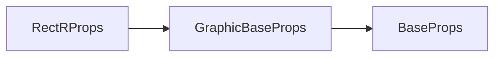

# g-rectr 标签 API 文档

本文档由 `DeepSeek R1` 模型生成并微调。

---



---

## 接口定义

```typescript
interface RectRProps extends GraphicBaseProps {
    /**
     * 圆形圆角参数 [左上, 右上, 右下, 左下]
     * - 1个值：全角相同
     * - 2个值：左上+右下 / 右上+左下
     * - 3个值：左上 / 右上+左下 / 右下
     * - 4个值：分别设置四个角 左上、右上、左下、右下
     */
    circle?: RectRCircleParams;

    /**
     * 椭圆圆角参数 [x半径, y半径, ...]
     * - 1组：全角相同
     * - 2组：左上+右下 / 右上+左下
     * - 3组：左上 / 右上+左下 / 右下
     * - 4组：分别设置四个角 左上、右上、左下、右下
     */
    ellipse?: RectREllipseParams;
}
```

---

## 核心行为规则

-   **参数限制**：若圆角值超过 `width/height` 的 50% 或为负数，将自动修正：
    -   负值 → 修正为 0
    -   超过 50% → 修正为 50%
-   **参数优先级**：`ellipse` 优先级高于 `circle`

---

## 完整示例集

### 示例 1：统一圆形圆角

```tsx
<g-rectr
    loc={[100, 100, 300, 200]} // x,y,width,height
    circle={[20]} // 所有角20px半径
    fill
    fillStyle="#3498db"
/>
```

---

### 示例 2：差异圆形圆角

```tsx
<g-rectr
    loc={[500, 200, 250, 150]}
    circle={[30, 15, 50, 0]} // 左上30px, 右上15px, 右下50px, 左下0px
    stroke
    strokeStyle="#2c3e50"
    strokeWidth={4}
/>
```

---

### 示例 3：椭圆圆角

```tsx
<g-rectr
    loc={[100, 400, 200, 100]}
    ellipse={[30, 20, 10, 40]} // 左上+右下(30,20), 右上+左下(10,40)
    fillStyle="#e74c3c"
    fillRule="nonzero"
/>
```

---

### 示例 4：混合椭圆圆角

```tsx
<g-rectr
    loc={[500, 400, 300, 200]}
    ellipse={[
        80,
        50, // 左上：水平80px 垂直50px
        40,
        100, // 右上：水平40px 垂直100px
        120,
        30, // 右下：水平120px 垂直30px
        60,
        80 // 左下：水平60px 垂直80px
    ]}
    fillStyle="#2ecc71"
    strokeWidth={2}
/>
```

---

## 参数对照表

### 圆形圆角（circle）参数规则

| 参数数量 | 生效规则                                     |
| -------- | -------------------------------------------- |
| 1        | 全角相同：`[20] → [20,20,20,20]`             |
| 2        | 对角对称：`[10,30] → [10,30,30,10]`          |
| 3        | 左上/对角/右下：`[10,20,30] → [10,20,30,20]` |
| 4        | 独立设置四个角：`[10,20,30,40]`              |

### 椭圆圆角（ellipse）参数规则

| 参数组数 | 生效规则                                       |
| -------- | ---------------------------------------------- |
| 1        | 全角相同：`[15,20] → 四角均为15x20`            |
| 2        | 对角对称：`[10,5,20,10] → 左上+右下/右上+左下` |
| 3        | 左上/对角/右下：`[10,20,15,5,20,10]`           |
| 4        | 独立设置四个角：`[10,20,15,25,20,30,5,10]`     |

---

## 错误处理示例

```tsx
// 危险参数示例
<g-rectr
    loc={[0, 0, 100, 50]}
    circle={[-10, 200]} // 输入 [-10, 200]
    stroke={true}
/>
```

**实际生效值**：

-   负值修正：`-10 → 0`
-   超限修正：`200 → min(200, 50/2=25) → 25px`
-   最终参数：`[0,25] → [0,25,25,0]`

---

## 最佳实践建议

1. **响应式圆角**：

```tsx
// 圆角随尺寸变化
<g-rectr
    loc={[x, y, width.value, height]}
    circle={[width.value * 0.1]} // 圆角为宽度的10%
/>
```
