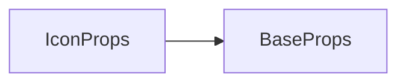

# icon 标签 API 文档

本文档由 `DeepSeek R1` 模型生成并微调。

---



---

## 接口定义

```typescript
interface IconProps extends BaseProps {
    icon: AllNumbers | AllIds; // 图标ID或数字标识
    frame?: number; // 显示指定帧（从0开始计数）
    animate?: boolean; // 是否启用帧动画循环（默认false）
}
```

---

## 核心属性说明

| 属性      | 类型                 | 默认值   | 说明                                                   |
| --------- | -------------------- | -------- | ------------------------------------------------------ |
| `icon`    | `number` \| `string` | **必填** | 图标资源标识符（对应素材库中的图块 ID 或预设数字编码） |
| `frame`   | `number`             | `0`      | 指定显示的帧序号（当`animate=false`时生效）            |
| `animate` | `boolean`            | `false`  | 启用自动播放帧动画（优先级高于`frame`参数）            |

---

## 完整示例集

### 示例 1：静态显示指定帧

```tsx
// 显示图块ID为"greenSlime"的第3帧（索引从0开始）
<icon
    loc={[100, 200]}
    icon="greenSlime" // 图标资源ID
    frame={2} // 显示第3帧
/>
```

---

### 示例 2：动态帧动画

```tsx
// 自动播放4帧循环动画
<icon
    loc={[300, 150]} // x=300, y=150
    icon={100} // 数字编码图标
    animate // 启用自动播放
/>
```

**动画行为**：

-   播放图标自带的 4 帧动画序列（0→1→2→3→0...）
-   动画速度由素材预设帧率决定

---

### 示例 3：交互控制动画

```tsx
import { ref } from 'vue';

const animating = ref(false);

const click = () => void (animating.value = false);

// 点击切换动画状态
<icon
    loc={[500, 300]}
    icon="yellowDoor"
    animate={animating.value}
    frame={0} // 动画停止时显示第1帧
    cursor="pointer"
    onClick={click}
/>;
```

**交互逻辑**：

-   初始状态显示第 1 帧（门关闭）
-   点击后播放开门动画

---

## 帧动画系统规则

### 帧索引定义

```typescript
// 图块素材帧结构示例
/*
  [0]  [1]  [2]  [3]
  +---+---+---+---+
  |   |   |   |   |  // 4帧水平排列的图块素材
  +---+---+---+---+
*/
```

-   **播放方向**：始终从 `0` 帧开始正向循环
-   **循环模式**：播放到最后一帧后回到第 `0` 帧

### 参数限制

| 场景                          | 系统行为                              |
| ----------------------------- | ------------------------------------- |
| `frame` 超过最大帧数          | 报错                                  |
| `frame` 为负数                | 报错                                  |
| `animate=true` 时修改 `frame` | `frame` 参数被忽略，始终从 0 开始播放 |
