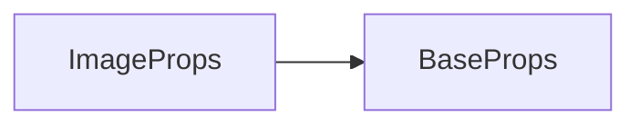

# image 标签 API 文档

本文档由 `DeepSeek R1` 模型生成并微调。

---



---

## 接口定义

```typescript
interface ImageProps extends BaseProps {
    /** 必填 - 图片对象（CanvasImageSource 类型） */
    image: CanvasImageSource;
}
```

---

## 核心功能

-   **尺寸控制**：通过 `width/height` 或 `loc` 简写属性定义图片尺寸（默认 200x200）
-   **像素风支持**：通过 `noanti=true` 禁用抗锯齿

---

## 使用示例

### 示例 1：基础图片显示

```tsx
const image = core.material.images.images['myimage.webp'];
// 显示 200x200 的默认尺寸图片
<image x={100} y={50} image={image} />;
```

**等效简写**：

```tsx
const image = core.material.images.images['myimage.webp'];

<image
    loc={[100, 50]} // width/height 使用默认 200x200
    image={image}
/>;
```

---

### 示例 2：自定义尺寸

```tsx
const image = core.material.images.images['myimage.webp'];
// 方式一：直接设置宽高
<image
    x={300}
    y={200}
    width={150} // 覆盖默认宽度
    height={80} // 覆盖默认高度
    image={image}
/>;

// 方式二：通过 loc 简写属性
<image
    loc={[500, 200, 120, 120]} // [x, y, width, height]
    image={image}
/>;
```

---

### 示例 3：像素风渲染（禁用抗锯齿）

```tsx
const pixelImage = core.material.images.images['myimage.webp'];

// 硬核像素风格配置
<image
    loc={[50, 50, 64, 64]}
    image={pixelImage}
    noanti // 关键配置：关闭抗锯齿
/>;
```

**效果说明**：

-   原始 32x32 像素图 → 放大为 64x64 像素
-   每个像素块保持锐利边缘

---

## 属性配置表

| 属性    | 类型                | 默认值   | 说明                                        |
| ------- | ------------------- | -------- | ------------------------------------------- |
| `image` | `CanvasImageSource` | **必填** | 图片资源（ImageBitmap/HTMLImageElement 等） |
