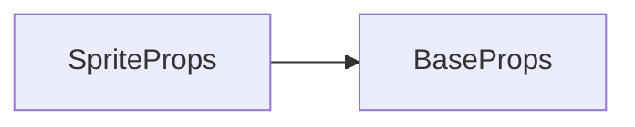

# sprite 标签 API 文档

本文档由 `DeepSeek R1` 模型生成并微调。

---



---

## 接口定义

```typescript
interface SpriteProps extends BaseProps {
    /**
     * 自定义渲染函数
     * @param canvas - 离屏画布对象
     * @param transform - 当前元素相对于父元素的变换矩阵
     */
    render?: (canvas: MotaOffscreenCanvas2D, transform: Transform) => void;
}
```

---

## 核心能力

通过 `render` 函数实现 **动态绘制**，可结合：

-   基础定位/变换参数（继承 `BaseProps`）
-   动画系统（`useAnimation`）
-   帧回调（`onTick`）
-   自定义图形绘制（路径/滤镜/混合模式）

**注意**，这个标签虽然非常基础，但是应该并不常用，因为很多内容都有对应的标签可以实现（例如线可以使用 `g-line` 标签等），因此如果你在考虑使用此标签，请确认你必须使用它，或是你的场景对性能非常敏感。

---

## 使用示例

### 示例 1：基础图形

```tsx
import { MotaOffscreenCanvas2D } from '@motajs/render-core';

// 绘制旋转了 45 度的彩色方块
const render = (canvas: MotaOffscreenCanvas2D) => {
    const ctx = canvas.ctx;
    ctx.fillStyle = 'rgba(255,0,0,0.8)';
    ctx.strokeStyle = 'blue';
    ctx.lineWidth = 3;
    ctx.beginPath();
    ctx.rect(0, 0, 200, 200);
    ctx.fill();
    ctx.stroke();
};

<sprite x={200} y={200} rotate={Math.PI / 4} render={render} />;
```

**效果**：

-   100x100 红色方块，中心点位于 (200,200)
-   45 度旋转，蓝色描边
-   80% 不透明度

---

### 示例 2：结合动画系统

```tsx
import { ref } from 'vue';
import { useAnimation } from '@motajs/render-vue';

// 平移动画 + 动态缩放
const [anim] = useAnimation();
anim.time(2000).move(100, 0).scale(1.5);

const loc = ref<ElementLocator>([0, 0]);
const scale = ref<ElementScaler>([1, 1]);

onTick(() => {
    loc.value = [anim.x, anim.y];
    scale.value = [anim.size, anim.size];
});

const render = canvas => {
    const ctx = canvas.ctx;
    ctx.rect(0, 0, 200, 200);
    ctx.fill();
};

return () => <sprite loc={loc.value} scale={scale.value} render={render} />;
```

**效果**：

-   矩形横向放大 1.5 倍，横向位置移动 100px
-   2 秒线性动画

---

### 示例 3：交互事件 + 滤镜

```tsx
import { ref } from 'vue';

// 悬浮模糊
const filter = ref('none');

const enter = () => {
    filter.value = 'blur(2px)';
};
const leave = () => {
    filter.value = 'none';
};

return () => (
    <sprite
        x={300}
        y={200}
        cursor="pointer"
        filter={filter.value}
        render={}
        onEnter={enter}
        onLeave={leave}
    />
);
```

**效果**：

-   鼠标悬浮时添加模糊滤镜
-   鼠标悬浮显示指针光标

---

## 注意事项

1. **坐标系**：`render` 函数内使用 **局部坐标系**，锚点变换已自动处理
2. **循环更新**：避免在 `render` 中循环更新自身
