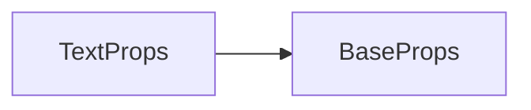

# TextProps API 文档

本文档由 `DeepSeek R1` 模型生成并微调。

---



---

## 接口定义

```typescript
interface TextProps extends BaseProps {
    text?: string; // 显示的文字内容
    fillStyle?: CanvasStyle; // 文字填充样式（颜色/渐变/图案）
    strokeStyle?: CanvasStyle; // 文字描边样式
    font?: Font; // 字体配置对象
    strokeWidth?: number; // 描边宽度（单位：像素）
}
```

---

## 使用示例

### 1. 基本文本渲染

```tsx
import { Font } from '@motajs/client';

<text
    loc={[100, 50]}
    text="Hello World"
    fillStyle="blue"
    font={new Font('Arial', 24, 'px', 700)}
/>;
```

**效果**：

-   在 (100,50) 位置显示蓝色 "Hello World"
-   使用 24px 粗体 Arial 字体
-   无描边效果

---

### 2. 描边文字 + 填充组合

```tsx
import { Font } from '@motajs/client';

<text
    loc={[200, 300]} // x=200, y=300
    text="MOTA Engine"
    fillStyle="gold"
    strokeStyle="rgba(0,0,0,0.8)"
    strokeWidth={2}
    font={new Font('Verdana', 32, 'px', 900, true)} // 斜体
/>;
```

**效果**：

-   金色文字带黑色半透明描边
-   32px 加粗斜体 Verdana
-   2px 描边宽度

---

### 3. 动态更新文本

```tsx
import { ref } from 'vue';
import { Font } from '@motajs/client';

// Vue3 组件示例
const count = ref(0);

onTick(() => {
    count.value++;
});

return () => (
    <text
        loc={[400, 100]}
        text={`计时: ${count.value} 帧`}
        fillStyle="#333"
        font={new Font('Consolas', 28)}
    />
);
```

---

## 高级用法示例

### 文字路径动画

```tsx
import { ref } from 'vue';
import { Font, onTick } from '@motajs/render';

const offset = ref(0);

onTick(() => {
    offset.value = (offset.value + 1) % 100;
});

<text
    x={100 + Math.sin(offset.value * 0.1) * 50} // X轴波动
    y={200 + offset.value}
    text="动态文字"
    fillStyle={`hsl(${offset.value * 3.6}, 80%, 50%)`} // 彩虹色
    font={new Font('Comic Sans MS', 32)}
/>;
```

---

### 文字阴影 + 滤镜

```tsx
import { Font } from '@motajs/client';

<text
    x={300}
    y={400}
    text="特效文字"
    fillStyle="white"
    font={new Font('Arial Black', 40)}
    filter="drop-shadow(5px 5px 2px rgba(0,0,0,0.5)) blur(1px)"
    strokeStyle="#333"
    strokeWidth={1}
/>;
```

---

## 属性兼容性表

| 属性          | 是否继承 BaseProps | 动态更新支持 | 性能影响等级 |
| ------------- | ------------------ | ------------ | ------------ |
| `text`        | 否                 | ✔️           | 中           |
| `fillStyle`   | 否                 | ✔️           | 中           |
| `strokeStyle` | 否                 | ✔️           | 中           |
| `font`        | 否                 | ✔️           | 高           |
| `strokeWidth` | 否                 | ✔️           | 低           |

---

## 注意事项

1. 考虑到浏览器兼容性，不建议在颜色中填写一些新标准的语法，例如 `rgb(0.3, 0.6, 0.8 / 0.6)` `#rgba` 等
