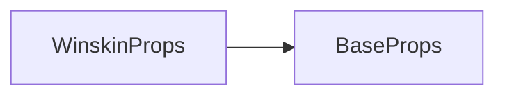

# winskin 标签 API 文档

本文档由 `DeepSeek R1` 模型生成并微调。

---



---

## 接口定义

```typescript
interface WinskinProps extends BaseProps {
    /**
     * 窗口皮肤图片资源ID
     */
    image: ImageIds;

    /**
     * 边框粗细
     * - 设置为 32 时表示原始大小（16 像素宽度），默认为 32
     * - 设为0时仅显示中心内容区
     */
    borderSize?: number;
}
```

---

## 核心功能演示

### 示例 1：基础窗口皮肤

```tsx
// 使用默认边框（borderSize=32）
<container>
    <winskin
        loc={[100, 100, 400, 300]} // x,y,width,height
        image="winskin.png" // 预加载的皮肤图片ID
    />
    <text x={120} y={120} text="对话框标题" />
    <text x={130} y={160} text="这里是正文内容区域..." />
</container>
```

---

### 示例 2：不同边框粗细对比

```tsx
// 细边框（borderSize=16）
<winskin loc={[50, 50, 200, 150]} image="winskin.png" borderSize={16} />;

// 粗边框（borderSize=32）
<winskin loc={[300, 50, 200, 150]} image="winskin.png" borderSize={32} />;

// 无边框（borderSize=0）
<winskin loc={[550, 50, 200, 150]} image="winskin.png" borderSize={0} />;
```

**效果差异**：

-   细边框：内容区域更大，适合信息密集场景
-   粗边框：装饰性更强，适合标题窗口
-   无边框：仅保留中心纹理，适合全屏背景

---

## 九宫格原理示意图

```typescript
/*
        +-------------------+
        | 1      top      2 |  ← borderSize
        |                   |
        |                   |
left    | 4    center    3  |    right
        |                   |
        |                   |
        | 5     bottom    6 |
        +-------------------+
*/
```

---

## 高级用法示例

### 动态边框动画

```tsx
import { hyper } from 'mutate-animate';
import { transitioned } from '@user/client-modules';
import { onTick } from '@motajs/render-vue';

const border = transitioned(16, 1000, hyper('sin', 'in-out'));
onTick(() => {
    if (border.value === 16) border.set(32);
    if (border.value === 32) border.set(16)
})

<container>
    <winskin
        loc={[200, 300, 400, 300]}
        image="winskin.png"
        borderSize={border.ref.value} // 边框呼吸动画效果
        composite="lighter" // 发光混合模式
    />
    <text x={20} y={20} text="魔法结界" font={magicFont} />
</container>;
```
