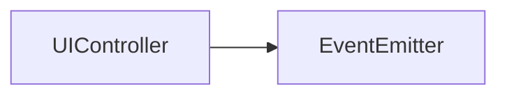

# UIController API 文档

本文档由 `DeepSeek R1` 模型生成并微调。



## 类描述

`UIController` 是 UI 控制系统的核心类，负责管理 UI 实例的显示栈、背景控制以及多种显示模式。继承自 `EventEmitter`，支持事件监听。

---

## 属性说明

| 属性名                | 类型                         | 描述                                                            |
| --------------------- | ---------------------------- | --------------------------------------------------------------- |
| `stack`               | `IUIInstance[]` (响应式数组) | 当前管理的 UI 实例栈                                            |
| `mode`                | `UIMode`                     | UI 显示模式，默认为 `LastOnlyStack`                             |
| `background`          | `IGameUI`                    | 背景 UI 的配置实例                                              |
| `backIns`             | `ShallowRef<IUIInstance>`    | 背景 UI 实例的响应式引用                                        |
| `showBack`            | `ComputedRef<boolean>`       | 当前是否显示背景（用户设置与系统状态共同决定）                  |
| `active`              | `Ref<boolean>`               | 系统是否显示 UI                                                 |
| `controllers`（静态） | `Map<string, UIController>`  | 静态属性，存储所有已创建的控制器实例，键为 `id`，值为控制器实例 |

---

## 构造方法

### `constructor`

```typescript
function constructor(id: string): UIController;
```

-   **参数**
    -   `id`: 控制器的唯一标识符（若重复会触发警告日志）

**示例**

```typescript
const mainController = new UIController('main');
```

---

## 方法说明

### `render`

```typescript
function render(): VNode;
```

渲染 UI 容器组件（用于 Vue 挂载）。

**示例**

```tsx
import { defineComponent } from 'vue';
import { UIController } from '@motajs/system-ui';

export const myController = new UIController('my-controller');

export const MyCom = defineComponent(() => {
    return () => <container>{myController.render()}</container>;
});
```

---

### `setBackground`

```typescript
function setBackground<T extends UIComponent>(
    back: IGameUI<T>,
    vBind: UIProps<T>
): void;
```

设置背景 UI 并初始化其实例。

-   **参数**
    -   `back`: 背景 UI 配置实例
    -   `vBind`: 传递给背景组件的 Props 对象

**示例**

```typescript
import { BackgroundUI } from './background';

// 显示背景组件，并传入参数 theme='dark'
mainController.setBackground(BackgroundUI, { theme: 'dark' });
```

---

### `hideBackground`

```typescript
function hideBackground(): void;
```

隐藏背景 UI （不影响系统状态）。

---

### `showBackground`

```typescript
function showBackground(): void;
```

显示背景 UI（不影响系统状态）。

---

### `keep`

```typescript
function keep(): IKeepController;
```

维持背景显示（防闪烁），返回控制器对象：

```typescript
interface IKeepController {
    safelyUnload(): void; // 安全卸载（仅在栈为空时关闭）
    unload(): void; // 强制立即卸载
}
```

**示例**

```typescript
const keeper = mainController.keep();
// 执行某些操作后...
keeper.safelyUnload();
```

---

### `open`

```typescript
function open<T extends UIComponent>(
    ui: IGameUI<T>,
    vBind: UIProps<T>,
    alwaysShow?: boolean
): IUIInstance<T>;
```

打开一个新 UI 实例并加入栈中。

-   **参数**
    -   `ui`: UI 配置实例
    -   `vBind`: 组件 Props
    -   `alwaysShow`: 是否强制显示（默认 `false`）
-   **返回值**
    打开的 UI 实例，可以用于关闭等操作

**示例**

```typescript
import { MyUI } from './myUI';

const instance = mainController.open(MyUI, { param: 80 });
```

---

### `close`

```typescript
function close(ui: IUIInstance): void;
```

关闭指定 UI 实例（根据当前模式可能影响其他实例）。

---

### `closeAll`

```typescript
function closeAll(ui?: IGameUI): void;
```

关闭所有或指定类型的所有 UI 实例。

-   **参数**
    -   `ui`（可选）: 指定要关闭的 UI 类型，不填时表示关闭所有 UI

---

### `lastOnly`

```typescript
function lastOnly(stack?: boolean): void;
```

切换显示模式：仅显示最后一个 UI（可设置为栈模式）

---

### `showAll`

```typescript
function showAll(stack?: boolean): void;
```

切换显示模式：显示所有非隐藏 UI（可设置为栈模式）

---

### `showCustom`

```typescript
function showCustom(config: IUICustomConfig): void;
```

切换显示模式：使用自定义模式（需实现 `IUICustomConfig`），参考[指南](../../guide/ui-system.md#自定义显示模式)

---

### `UIController.getController`

```typescript
function getController(id: string): UIController | null;
```

**静态方法**：根据 ID 获取控制器实例。

**示例**

```typescript
const ctrl = UIController.getController('main');
```

---

## 事件说明

| 事件名  | 参数类型                        | 触发时机           |
| ------- | ------------------------------- | ------------------ |
| `open`  | `ui: IGameUI, ins: IUIInstance` | 新 UI 实例被打开时 |
| `close` | `ins: IUIInstance`              | UI 实例被关闭时    |

**事件监听示例**

```typescript
mainController.on('open', (ui, ins) => {
    console.log(`Opened UI: ${ui.name}`);
});
```

---

## 总使用示例

```typescript
import { BackgroundUI, DialogUI } from './myUI';

// 事件监听
mainController.on('close', ins => {
    console.log('UI closed:', ins.ui.name);
});

// 设置背景
mainController.setBackground(BackgroundUI, { color: '#333' });

// 打开 UI
const dialogIns = mainController.open(DialogUI, { title: '提示' });

// 切换显示模式，仅显示最后一个，启用栈模式
mainController.lastOnly(true);

// 关闭 UI
mainController.close(dialogIns);
```
