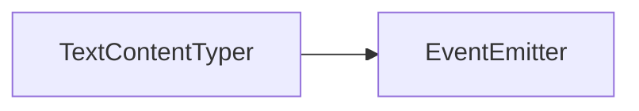

# TextContentTyper API 文档

本文档由 `DeepSeek R1` 模型生成并微调。



## 类描述

`TextContentTyper` 是文字逐字输出（打字机效果）的核心控制器，继承自 `EventEmitter`。用于管理文字排版、渲染时序及样式配置，支持动态修改文本内容和样式。

---

## 核心属性说明

| 属性名   | 类型                    | 描述                                           |
| -------- | ----------------------- | ---------------------------------------------- |
| `config` | `Required<TyperConfig>` | 当前文字渲染配置（包含字体、行高、对齐等参数） |
| `parser` | `TextContentParser`     | 文字解析器实例（负责分词、分行等底层处理）     |

---

## 核心方法说明

### `constructor`

```typescript
function constructor(config: Partial<ITextContentConfig>): TextContentTyper;
```

初始化打字机实例，接受文字配置参数：

```typescript
interface ITextContentConfig {
    /** 字体 */
    font: Font;
    /** 是否持续上一次的文本，开启后，如果修改后的文本以修改前的文本为开头，那么会继续播放而不会从头播放（暂未实现，后续更新） */
    keepLast: boolean;
    /** 打字机时间间隔，即两个字出现之间相隔多长时间 */
    interval: number;
    /** 行高 */
    lineHeight: number;
    /** 分词规则 */
    wordBreak: WordBreak;
    /** 文字对齐方式 */
    textAlign: TextAlign;
    /** 行首忽略字符，即不会出现在行首的字符 */
    ignoreLineStart: Iterable<string>;
    /** 行尾忽略字符，即不会出现在行尾的字符 */
    ignoreLineEnd: Iterable<string>;
    /** 会被分词规则识别的分词字符 */
    breakChars: Iterable<string>;
    /** 填充样式 */
    fillStyle: CanvasStyle;
    /** 描边样式 */
    strokeStyle: CanvasStyle;
    /** 线宽 */
    strokeWidth: number;
    /** 文字宽度，到达这么宽之后换行 */
    width: number;
}
```

---

### `setConfig`

```typescript
function setConfig(config: Partial<ITextContentConfig>): void;
```

动态更新配置参数（支持部分更新）

---

### `setText`

```typescript
function setText(text: string): void;
```

设置要显示的文本内容（自动重置播放进度）

---

### `type`

```typescript
function type(): void;
```

启动逐字显示效果

---

### `typeAll`

```typescript
function typeAll(): void;
```

立即完整显示所有文字

---

### `setRender`

```typescript
function setRender(render: TyperFunction): void;
```

设置自定义渲染逻辑：

```typescript
type TyperFunction = (
    data: TyperRenderable[], // 待渲染元素
    typing: boolean // 是否正在播放中
) => void;
```

---

## 事件说明

| 事件名      | 参数 | 触发时机           |
| ----------- | ---- | ------------------ |
| `typeStart` | `[]` | 开始逐字显示时     |
| `typeEnd`   | `[]` | 全部文字显示完成时 |

---

## 使用示例

### 基础用法 - 对话框文字

```typescript
// 初始化配置
const typer = new TextContentTyper({
    font: new Font('黑体', 18),
    interval: 50,
    lineHeight: 1.2,
    width: 400
});

// 设置文本内容
typer.setText(`「这是逐字显示的文字效果...
            第二行会自动换行」`);

// 注册渲染逻辑
typer.setRender((elements, isTyping) => {
    elements.forEach(element => {
        if (element.type === TextContentType.Text) {
            drawText(element.x, element.y, element.text);
        }
    });
});

// 开始播放
typer.type();
```

### 动态样式修改

```typescript
// 修改为红色斜体
typer.setConfig({
    font: new Font('楷体', 20),
    fillStyle: '#ff0000'
});

// 修改播放速度
typer.setConfig({ interval: 30 });
```

---

## 底层数据结构

### 渲染元素类型

```typescript
type TyperRenderable =
    | TyperTextRenderable // 文本元素
    | TyperIconRenderable // 图标元素
    | TyperWaitRenderable; // 等待间隔
```

::: code-group

```ts [TyperTextRenderable]
interface TyperTextRenderable {
    type: TextContentType.Text;
    x: number;
    y: number;
    text: string;
    font: string;
    fillStyle: CanvasStyle;
    strokeStyle: CanvasStyle;
    /** 文字画到哪个索引 */
    pointer: number;
    /** 这段文字的总高度 */
    height: number;
}
```

```ts [TyperWaitRenderable]
interface TyperWaitRenderable {
    type: TextContentType.Wait;
    wait: number;
    waited: number;
}
```

:::

---

## 注意事项

1. **性能优化**  
   当处理长文本（>1000 字）时，建议预调用 `parser.parse()`

2. **坐标系统**  
   所有坐标基于初始化时设置的 `width` 参数进行相对计算

3. **动态修改限制**  
   在播放过程中修改配置可能导致渲染异常，建议在 `typeEnd` 事件后操作

4. **使用场景**  
   本接口的使用场景并不多，建议使用 `TextContent` 组件。如果必须使用的话，可以直接阅读源码来看一些实现细节。
