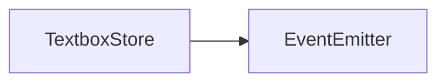

# TextboxStore API 文档

本文档由 `DeepSeek R1` 模型生成并微调。

---



---

## 类描述

`TextboxStore` 是文本框的集中管理器，继承自 `EventEmitter`。所有 `Textbox` 组件实例化时会自动注册到该类的静态 `list` 中，支持通过 ID 精准控制特定文本框。

---

## 核心方法说明

### `TextboxStore.get`

```typescript
function get(id: string): TextboxStore | undefined;
```

**静态方法**：通过 ID 获取已注册的文本框控制器

-   **参数**  
    `id`: 文本框的唯一标识符
-   **返回值**  
    找到返回实例，否则返回 `undefined`

---

### `setText`

```typescript
function setText(text: string): void;
```

**动态更新文本内容**

-   **特性**
    -   自动重置打字机进度
    -   触发重新排版计算

---

### `modify`

```typescript
function modify(data: Partial<TextboxProps>): void;
```

**动态修改文本框配置**

-   **参数**  
    `data`: 需更新的属性（支持所有 `TextboxProps` 属性）

---

### `endType`

```typescript
function endType(): void;
```

**立即结束打字机动画**

-   **特性**
    -   强制显示全部文本
    -   触发 `typeEnd` 事件

---

### `show`

```ts
function show(): void;
```

### `hide`

```ts
function hide(): void;
```

控制文本框的显示和隐藏。

---

## 使用示例

### 跨场景更新对话内容

```typescript
// 在剧情管理器中的调用
const updateChapterDialog = (chapterId: string) => {
    const store = TextboxStore.get(`chapter_${chapterId}`);
    store?.setText(getChapterText(chapterId));
    store?.modify({ title: `第 ${chapterId} 章` });
};
```

### 紧急提示打断当前动画

```typescript
// 强制显示关键信息
const showEmergencyAlert = () => {
    const alertBox = TextboxStore.get('system_alert');
    alertBox?.setText('警告！基地即将爆炸！');
    alertBox?.endType(); // 跳过打字动画
    alertBox?.show();
};
```

### 动态样式调整

```typescript
// 根据昼夜切换对话框样式
const updateDialogStyle = (isNight: boolean) => {
    TextboxStore.list.forEach(store => {
        store.modify({
            backColor: isNight ? '#1A1A32' : '#F0F0FF',
            titleFill: isNight ? '#E6E6FA' : '#2F4F4F'
        });
    });
};
```

---

## 注意事项

1. **ID 管理规范**  
   建议显式指定可预测的 ID 格式：

    ```tsx
    // 创建时指定可追踪 ID
    <Textbox id={`npc_${npcId}_dialog`} ... />
    ```

2. **未找到实例处理**  
   调用前需做空值检测：

    ```typescript
    const store = TextboxStore.get('custom_id');
    if (!store) {
        console.warn('文本框未注册: custom_id');
        return;
    }
    ```

3. **生命周期匹配**  
   在组件卸载时自动注销实例，请勿持有长期引用

4. **批量操作优化**  
   同时操作多个实例时建议使用迭代器：
    ```typescript
    // 隐藏所有对话框
    TextboxStore.list.forEach(store => store.hide());
    ```
