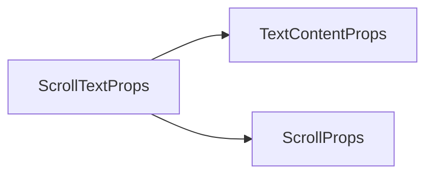

# ScrollText 组件 API 文档

本文档由 `DeepSeek R1` 模型生成并微调。

---

## 核心特性

-   **自动滚动**：支持设定滚动速度的纵向滚动效果
-   **长文本支持**：内置高性能文本渲染引擎
-   **精准控制**：提供播放/暂停/调速等操作接口
-   **智能布局**：自动计算文本高度和滚动距离

---

## Props 属性说明



完全继承 `TextContent` 组件和 `Scroll` 组件的参数和事件。

| 属性名  | 类型             | 默认值 | 描述                        |
| ------- | ---------------- | ------ | --------------------------- |
| `speed` | `number`         | 必填   | 滚动速度（像素/秒）         |
| `width` | `number`         | 必填   | 文本区域固定宽度（像素）    |
| `loc`   | `ElementLocator` | 必填   | 容器定位 [x,y,width,height] |
| `pad`   | `number`         | `16`   | 首行前空白距离（像素）      |

---

## 事件说明

| 事件名      | 参数 | 触发时机             |
| ----------- | ---- | -------------------- |
| `scrollEnd` | -    | 滚动到文本末尾时触发 |

---

## Exposed Methods 暴露方法

| 方法名     | 参数            | 返回值 | 描述                        |
| ---------- | --------------- | ------ | --------------------------- |
| `pause`    | -               | void   | 暂停滚动                    |
| `resume`   | -               | void   | 继续滚动                    |
| `setSpeed` | `speed: number` | void   | 动态调整滚动速度（像素/秒） |
| `rescroll` | -               | void   | 立即重置到起始位置重新滚动  |

---

## 使用示例

### 基础滚动

```tsx
import { defineComponent } from 'vue';

export const MyCom = defineComponent(() => {
    const longText = '序幕\n'.repeat(100) + '——全剧终——';

    return () => (
        <ScrollText
            text={longText}
            speed={80} // 每秒滚动80像素
            width={416} // 文本区域宽度
            loc={[0, 0, 416, 416]} // 容器位置和尺寸
            fillStyle="#E6E6FA" // 薰衣草色文字
        />
    );
});
```

### 动态控制

```tsx
import { defineComponent, ref } from 'vue';

export const MyCom = defineComponent(() => {
    const longText = '序幕\n'.repeat(100) + '——全剧终——';
    const scrollRef = ref<ScrollTextExpose>();

    // 暂停/恢复控制
    const toggleScroll = () => {
        if (scrollRef.value?.isPaused) {
            scrollRef.value.resume();
        } else {
            scrollRef.value?.pause();
        }
    };

    // 速度控制
    const accelerate = () => {
        scrollRef.value?.setSpeed(200);
    };

    return () => (
        <ScrollText
            ref={scrollRef}
            text={longText}
            speed={100}
            width={416}
            loc={[0, 0, 416, 416]}
            onScrollEnd={() => console.log('滚动结束')}
        />
    );
});
```

### 复杂排版

```tsx
const staffText =
    '\\c[32]====制作人员====\\c\n\n' +
    '\\r[#FFD700]总监督\\r\t\t张三\n' +
    '\\r[#00FF00]美术指导\\r\\t李四\n' +
    '特别感谢：某某公司';

<ScrollText
    text={staffText}
    speed={120}
    width={720}
    loc={[40, 40, 720, 560]}
    pad={40} // 顶部留白
    font={new Font('黑体', 24)}
    lineHeight={8} // 行间距
    interval={0} // 禁用打字机效果
/>;
```

---

## 注意事项

1. **容器尺寸**  
   实际可滚动区域计算公式：

    ```
    可视高度 = loc[3]（容器高度）
    滚动距离 = 文本总高度 + pad（首行前空白）
    ```

2. **速度控制**  
   推荐速度范围 50-200 像素/秒

3. **组合动画**  
   可与容器变换配合实现复杂效果：
    ```tsx
    <container rotation={-5} alpha={0.9}>
        <ScrollText />
    </container>
    ```
