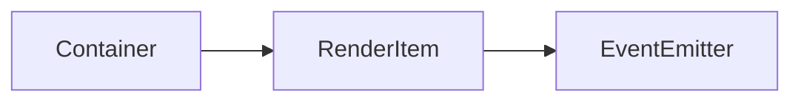

# Container 类 API 文档

本文档由 `DeepSeek R1` 模型生成并微调。

---

## 继承关系



## 属性说明

| 属性名           | 类型           | 默认值 | 说明                           |
| ---------------- | -------------- | ------ | ------------------------------ |
| `sortedChildren` | `RenderItem[]` | `[]`   | 按 `zIndex` 排序后的子元素列表 |

---

## 构造方法

### `constructor`

**参数**

-   `type`: 渲染模式（`absolute` 绝对定位 / `static` 跟随摄像机）
-   `cache`: 是否启用渲染缓存
-   `fall`: 是否启用变换矩阵下穿机制

**示例**

```typescript
const container = new Container('static');
```

---

## 方法说明

### `appendChild`

```typescript
function appendChild(...children: RenderItem[]): void;
```

**描述**  
添加子元素并触发重新排序。  
**示例**

```typescript
const child = new RenderItem('static');
container.appendChild(child); // 添加子元素
```

---

### `removeChild`

```typescript
function removeChild(...child: RenderItem[]): void;
```

**描述**  
移除指定子元素并触发重新排序。  
**示例**

```typescript
container.removeChild(child); // 移除子元素
```

---

### `requestSort`

```typescript
function requestSort(): void;
```

**描述**  
标记需要重新排序子元素（在下一帧前自动执行）。

---

### `forEachChild`

```typescript
function forEachChild(fn: (ele: RenderItem) => void): void;
```

**描述**
遍历元素的每一个子元素（DFS 遍历），并对每一个元素执行函数。

---

## 总使用示例

```typescript
// 创建基础容器
const baseContainer = new Container('absolute');
baseContainer.size(800, 600);

// 添加子元素
const sprite1 = new Sprite('static');
sprite1.pos(100, 100).setZIndex(2);
baseContainer.appendChild(sprite1);

const sprite2 = new Sprite('static');
sprite2.pos(200, 200).setZIndex(1);
baseContainer.appendChild(sprite2);

// 将容器添加到根元素
rootElement.appendChild(baseContainer);

// 动态修改子元素层级
sprite1.setZIndex(0); // 自动触发重新排序
```
