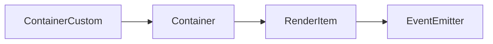

# ContainerCustom 类 API 文档

本文档由 `DeepSeek R1` 模型生成并微调。

---

## 继承关系



---

## 属性说明

| 属性名     | 类型                      | 默认值      | 说明                   |
| ---------- | ------------------------- | ----------- | ---------------------- |
| `renderFn` | `CustomContainerRenderFn` | `undefined` | 自定义渲染函数（可选） |

---

## 构造方法

继承自 `Container`，参数与父类一致。

---

## 方法说明

### `setRenderFn`

```typescript
function setRenderFn(render?: CustomContainerRenderFn): void;
```

**描述**  
设置自定义渲染函数，覆盖默认的子元素渲染逻辑。  
**参数**

-   `render`: 接收画布、子元素列表和变换矩阵的回调函数

**示例**

```typescript
customContainer.setRenderFn((canvas, children, transform) => {
    children.forEach(child => {
        child.renderContent(canvas, transform);
    });
});
```

---

## 总使用示例

```ts
// 创建自定义容器
const customContainer = new ContainerCustom('static');
customContainer.setRenderFn((canvas, children) => {
    // 倒序渲染子元素
    children.reverse().forEach(child => {
        child.renderContent(canvas, Transform.identity);
    });
});
```
