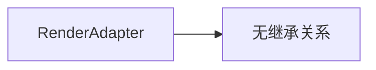

# RenderAdapter API 文档

本文档由 `DeepSeek R1` 模型生成并微调。

---



_RenderAdapter 为独立类，无父类或子类。_

---

## 属性说明

| 属性名             | 类型                              | 描述                           |
| ------------------ | --------------------------------- | ------------------------------ |
| `items`            | `Set<T>`                          | 所有元素的集合                 |
| `id`               | `string`                          | 适配器的唯一标识符             |
| `adapters`（静态） | `Map<string, RenderAdapter<any>>` | 全局存储所有已创建的适配器实例 |

---

## 构造方法

### `constructor`

```typescript
function constructor(id: string): RenderAdapter<T>;
```

创建一个适配器实例并自动注册到全局 `adapters` 集合中。  
**示例：**

```typescript
const adapter = new RenderAdapter<HTMLElement>('ui-elements');
```

---

## 方法说明

### `add`

```typescript
function add(item: T): void;
```

向集合中添加一个元素。  
**示例：**

```typescript
adapter.add(document.getElementById('box'));
```

### `remove`

```typescript
function remove(item: T): void;
```

从集合中移除一个元素。  
**示例：**

```typescript
adapter.remove(document.getElementById('box'));
```

### `receiveGlobal`

```typescript
function receiveGlobal(
    id: string,
    fn: (...params: any[]) => Promise<any>
): void;
```

注册全局异步函数（不与具体元素绑定）。  
**示例：**

```typescript
adapter.receiveGlobal('refresh', async () => {
    await fetchData();
});
```

### `receive`

```typescript
function receive(
    id: string,
    fn: (item: T, ...params: any[]) => Promise<any>
): void;
```

注册元素的异步执行函数。  
**示例：**

```typescript
adapter.receive('fadeOut', async (element: HTMLElement) => {
    element.style.opacity = '0';
    await new Promise(resolve => setTimeout(resolve, 1000));
});
```

### `receiveSync`

```typescript
function receiveSync(id: string, fn: (item: T, ...params: any[]) => any): void;
```

注册元素的同步执行函数。  
**示例：**

```typescript
adapter.receiveSync('highlight', (element: HTMLElement) => {
    element.style.backgroundColor = 'yellow';
});
```

### `all`

```typescript
function all<R = any>(fn: string, ...params: any[]): Promise<R[]>;
```

对所有元素执行异步函数，返回 `Promise.all` 结果。  
**示例：**

```typescript
await adapter.all('fadeOut'); // 所有元素淡出
```

### `any`

```typescript
function any<R = any>(fn: string, ...params: any[]): Promise<R>;
```

对所有元素执行异步函数，返回 `Promise.any` 结果。  
**示例：**

```typescript
await adapter.any('loadImage'); // 任一图片加载完成即继续
```

### `sync`

```typescript
function sync<R = any>(fn: string, ...params: any[]): R[];
```

对所有元素执行同步函数。  
**示例：**

```typescript
adapter.sync('highlight'); // 所有元素高亮
```

### `global`

```typescript
function global<R = any>(id: string, ...params: any[]): Promise<R>;
```

调用全局异步函数。  
**示例：**

```typescript
await adapter.global('refresh'); // 触发全局刷新
```

### `destroy`

```typescript
function destroy(): void;
```

销毁适配器实例并从全局 `adapters` 中移除。  
**示例：**

```typescript
adapter.destroy();
```

---

## 静态方法说明

### `RenderAdapter.get`

```typescript
function get<T>(id: string): RenderAdapter<T> | undefined;
```

通过 ID 获取已注册的适配器实例。  
**示例：**

```typescript
const adapter = RenderAdapter.get<HTMLElement>('ui-elements');
```

---

## 总使用示例

```typescript
// 创建适配器
const animationAdapter = new RenderAdapter<HTMLElement>('animations');

// 注册动画函数
animationAdapter.receive('slideLeft', async (element: HTMLElement) => {
    element.style.transform = 'translateX(-100px)';
    await new Promise(resolve => setTimeout(resolve, 500));
});

// 添加元素
const box = document.getElementById('box');
animationAdapter.add(box);

// 执行动画
animationAdapter.all('slideLeft').then(() => {
    console.log('所有元素滑动完成');
});

// 销毁适配器
animationAdapter.destroy();
```
