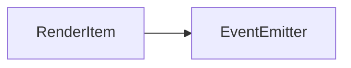

# RenderItem 类 API 文档

**需丰富**

本文档由 `DeepSeek R1` 模型生成并微调。

---

## 继承关系



---

## 接口说明

### IRenderUpdater

```typescript
interface IRenderUpdater {
    update(item?: RenderItem): void;
}
```

**描述**  
定义元素更新能力的接口。`RenderItem` 通过 `update` 方法通知父元素需要重新渲染。

---

### IRenderAnchor

```typescript
interface IRenderAnchor {
    anchorX: number;
    anchorY: number;
    setAnchor(x: number, y: number): void;
}
```

**描述**  
管理元素锚点的接口。锚点用于定位元素的渲染基准点（如中心点、左上角等）。

---

### IRenderConfig

```typescript
interface IRenderConfig {
    highResolution: boolean;
    antiAliasing: boolean;
    setHD(hd: boolean): void;
    setAntiAliasing(anti: boolean): void;
}
```

**描述**  
管理画布渲染配置的接口，控制高清模式和抗锯齿的开关。

---

### IRenderChildable

```typescript
interface IRenderChildable {
    children: Set<RenderItem>;
    appendChild(...child: RenderItem[]): void;
    removeChild(...child: RenderItem[]): void;
    requestSort(): void;
}
```

**描述**  
管理子元素的接口。需在子类中实现具体逻辑（如 `Container` 元素）。

## 属性说明

| 属性名           | 类型                       | 默认值          | 说明                                                 |
| ---------------- | -------------------------- | --------------- | ---------------------------------------------------- |
| `uid`            | `number`                   | 自动递增        | 元素的唯一标识符                                     |
| `id`             | `string`                   | `''`            | 元素 ID（原则不可重复）                              |
| `zIndex`         | `number`                   | `0`             | 元素的纵深层级（决定遮挡关系）                       |
| `width`          | `number`                   | `200`           | 元素的逻辑宽度                                       |
| `height`         | `number`                   | `200`           | 元素的逻辑高度                                       |
| `anchorX`        | `number`                   | `0`             | 锚点横坐标（`0` 左端，`1` 右端）                     |
| `anchorY`        | `number`                   | `0`             | 锚点纵坐标（`0` 上端，`1` 下端）                     |
| `type`           | `RenderItemPosition`       | `'static'`      | 渲染模式（`absolute` 绝对定位，`static` 跟随摄像机） |
| `highResolution` | `boolean`                  | `true`          | 是否启用高清画布                                     |
| `antiAliasing`   | `boolean`                  | `true`          | 是否启用抗锯齿                                       |
| `hidden`         | `boolean`                  | `false`         | 元素是否隐藏                                         |
| `filter`         | `string`                   | `'none'`        | 元素的滤镜效果                                       |
| `composite`      | `GlobalCompositeOperation` | `'source-over'` | 渲染混合模式                                         |
| `alpha`          | `number`                   | `1`             | 元素的不透明度（`0` 透明，`1` 不透明）               |
| `cursor`         | `string`                   | `'inherit'`     | 鼠标悬停时的光标样式                                 |
| `noEvent`        | `boolean`                  | `false`         | 是否忽略交互事件                                     |
| `isRoot`         | `boolean`                  | `false`         | 是否为根元素（需实现 `IRenderTreeRoot` 接口）        |
| `connected`      | `boolean`                  | 自动计算        | 元素是否已连接到根元素                               |

**特殊属性说明**

-   `transform`: 元素的变换矩阵（`Transform` 实例），修改时会自动触发 `updateTransform`。

---

## 构造方法

### `constructor(type: RenderItemPosition, enableCache: boolean = true, transformFallThrough: boolean = false)`

**参数**

-   `type`: 渲染模式（`absolute` 或 `static`）
-   `enableCache`: 是否启用渲染缓存（默认启用）
-   `transformFallThrough`: 是否启用变换矩阵下穿机制（默认关闭）

**示例**

```typescript
const item = new RenderItem('absolute');
```

---

## 方法说明

### `size`

```typescript
function size(width: number, height: number): void;
```

**描述**  
设置元素的尺寸。  
**示例**

```typescript
item.size(300, 200); // 设置宽度 300，高度 200
```

---

### `pos`

```typescript
function pos(x: number, y: number): void;
```

**描述**  
设置元素的坐标（等效于修改 `transform` 的平移量）。  
**示例**

```typescript
item.pos(100, 50); // 设置坐标为 (100, 50)
```

---

### `append`

```typescript
function append(parent: RenderItem): void;
```

**描述**  
将元素添加到指定父元素下。  
**示例**

```typescript
const parent = new RenderItem('static');
item.append(parent); // 将 item 添加为 parent 的子元素
```

---

### `remove`

```typescript
function remove(): boolean;
```

**描述**  
从父元素中移除当前元素。  
**返回值**

-   `true` 表示移除成功，`false` 表示失败。  
    **示例**

```typescript
item.remove(); // 从父元素中移除
```

---

### `hide`

```typescript
function hide(): void;
```

**描述**  
隐藏元素。  
**示例**

```typescript
item.hide(); // 隐藏元素
```

---

### `show`

```typescript
function show(): void;
```

**描述**  
显示元素。  
**示例**

```typescript
item.show(); // 显示元素
```

---

### `delegateTicker`

```typescript
function delegateTicker(fn: TickerFn, time?: number, end?: () => void): number;
```

**描述**  
委托动画帧函数，持续执行指定时间。  
**返回值**

-   委托 ID，可用于移除。  
    **示例**

```typescript
const id = item.delegateTicker(() => {
    console.log('每帧执行');
}, 1000); // 持续 1 秒
```

---

### `destroy`

```typescript
function destroy(): void;
```

**描述**  
销毁元素，释放资源。  
**示例**

```typescript
item.destroy(); // 销毁元素
```

### `getAbsolutePosition`

```typescript
function getAbsolutePosition(x?: number, y?: number): [number, number];
```

**描述**  
获取元素在全局坐标系中的绝对坐标。  
**示例**

```typescript
const [absX, absY] = item.getAbsolutePosition(); // 获取元素原点绝对坐标
```

---

### `getBoundingRect`

```typescript
function getBoundingRect(): DOMRectReadOnly;
```

**描述**  
获取元素的包围矩形（相对于父元素坐标系）。  
**示例**

```typescript
const rect = item.getBoundingRect();
console.log(rect.width, rect.height);
```

---

### `setZIndex`

```typescript
function setZIndex(zIndex: number): void;
```

**描述**  
设置元素的纵深层级（`zIndex` 越大越靠前）。  
**示例**

```typescript
item.setZIndex(5); // 置顶显示
```

---

### `requestRenderFrame`

```typescript
function requestRenderFrame(fn: () => void): void;
```

**描述**  
在下一帧渲染时执行函数（适用于需要在渲染流程中更新的操作）。  
**示例**

```typescript
item.requestRenderFrame(() => {
    item.pos(item.x + 1, item.y); // 每帧右移 1 单位
});
```

---

### `setFilter`

```typescript
function setFilter(filter: string): void;
```

**描述**  
设置元素的 CSS 滤镜效果（如模糊、灰度等）。  
**示例**

```typescript
item.setFilter('blur(5px)'); // 添加模糊效果
```

---

## 受保护方法说明

### `render`

```typescript
protected abstract render(canvas: MotaOffscreenCanvas2D, transform: Transform): void;
```

**描述**  
抽象渲染方法，子类必须实现此方法以定义具体渲染逻辑。  
**示例**

```typescript
class CustomItem extends RenderItem {
    protected render(canvas: MotaOffscreenCanvas2D) {
        canvas.ctx.fillStyle = 'red';
        canvas.ctx.fillRect(0, 0, this.width, this.height);
    }
}
```

---

### `isActionInElement`

```typescript
protected isActionInElement(x: number, y: number): boolean;
```

**描述**  
判断坐标点是否在元素范围内（可覆盖实现自定义碰撞检测）。  
**默认行为**  
检测坐标是否在 `[0, width] x [0, height]` 矩形内。

---

## 静态方法说明

### `RenderItem.ticker`

**类型**

```typescript
const ticker: Ticker;
```

**描述**  
全局动画帧管理器，用于处理所有委托的动画帧函数。

---

## 事件说明

事件继承自 [ERenderItemActionEvent](./Event.md#erenderitemactionevent)

| 事件名         | 参数类型                  | 说明               |
| -------------- | ------------------------- | ------------------ |
| `beforeRender` | `Transform`               | 渲染前触发         |
| `afterRender`  | `Transform`               | 渲染后触发         |
| `destroy`      | `[]`                      | 元素销毁时触发     |
| `transform`    | `[RenderItem, Transform]` | 变换矩阵更新时触发 |

---

## 总使用示例

::: code-group

```typescript [基础操作]
// 创建元素（以 Sprite 为例）
const item = new Sprite('static');

// 设置属性
item.size(400, 300);
item.pos(100, 50);
item.setAnchor(0.5, 0.5); // 设置中心锚点
item.setZIndex(2);

// 监听渲染事件
item.on('beforeRender', transform => {
    console.log('即将渲染，变换矩阵:', transform);
});

// 添加动画效果
const tickerId = item.delegateTicker(time => {
    item.pos(Math.sin(time / 1000) * 100, 50);
});

// 销毁元素
setTimeout(() => {
    item.destroy();
}, 5000);
```

```typescript [创建自定义元素]
// 创建自定义可交互元素
class Button extends RenderItem {
    constructor() {
        super('static');
        this.size(100, 40);
        this.on('click', ev => {
            console.log('按钮被点击！坐标:', ev.offsetX, ev.offsetY);
        });
    }

    protected render(canvas: MotaOffscreenCanvas2D) {
        // 绘制圆角矩形按钮
        const ctx = canvas.ctx;
        ctx.fillStyle = '#4CAF50';
        ctx.roundRect(0, 0, this.width, this.height, 8);
        ctx.fill();
    }
}

// 使用按钮
const button = new Button();
button.pos(200, 150);
button.append(parentElement);

// 添加鼠标悬停效果
button.on('enter', () => button.setFilter('brightness(1.2)'));
button.on('leave', () => button.setFilter('none'));
```

:::
