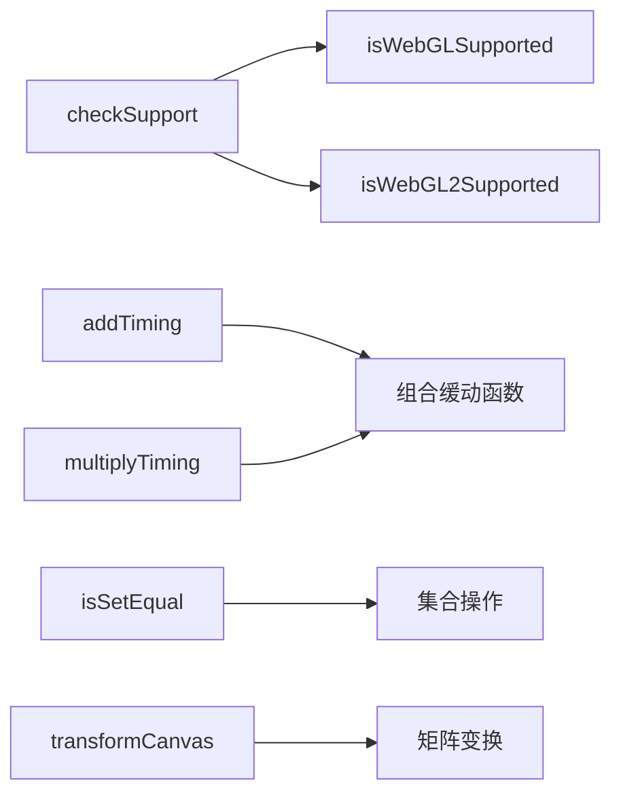

# 函数 API 文档

本文档由 `DeepSeek R1` 模型生成并微调。

---

## 函数说明

### `isWebGLSupported`

**功能**  
检测浏览器是否支持 WebGL 1.0  
**返回值**

-   `true`: 支持
-   `false`: 不支持

**示例**

```typescript
if (isWebGLSupported()) {
    // 初始化 WebGL 1.0 功能
}
```

---

### `isWebGL2Supported`

**功能**
检测浏览器是否支持 WebGL 2.0  
**返回值**

-   `true`: 支持
-   `false`: 不支持

---

### `addTiming`

**功能**
组合两个缓动函数为加法函数  
**数学表达**
`newTiming(p) = timing1(p) + timing2(p)`

**参数**

-   `timing1`: 第一个缓动函数
-   `timing2`: 第二个缓动函数

**示例**

```typescript
const linear = (p: number) => p;
const bounce = (p: number) => p * p;
const combined = addTiming(linear, bounce); // p + p²
```

---

### `multiplyTiming`

**功能**  
组合两个缓动函数为乘法函数  
**数学表达**  
`newTiming(p) = timing1(p) * timing2(p)`

---

### `isSetEqual`

**功能**  
判断两个集合是否相等（元素完全相同）  
**实现逻辑**

1. 直接引用相同 → `true`
2. 大小不同 → `false`
3. 检查 set1 是否是 set2 的子集

---

### `transformCanvas`

**功能**  
将变换矩阵应用到画布上下文  
**实现逻辑**

```typescript
const mat = transform.mat; // 获取 3x3 矩阵
const [a, b, , c, d, , e, f] = mat; // 分解为 2D 变换参数
ctx.transform(a, b, c, d, e, f); // 应用变换
```

**参数**

-   `canvas`: 目标画布对象
-   `transform`: 变换矩阵

**示例**

```typescript
const transform = new Transform();
transform.translate(100, 50);
transformCanvas(myCanvas, transform); // 应用平移变换
```

---

## 工具函数关系图


