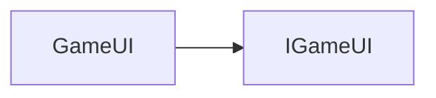

# GameUI API 文档

本文档由 `DeepSeek R1` 模型生成并微调。



_实现 `IGameUI` 接口_

## 接口描述

`IGameUI<C>` 是 UI 系统的核心接口，定义了 UI 实例的基础结构和静态操作方法。

---

## 属性说明

| 属性名         | 类型                               | 描述                                                                |
| -------------- | ---------------------------------- | ------------------------------------------------------------------- |
| `name`         | `string`                           | 只读，UI 的唯一标识名称                                             |
| `component`    | `C extends UIComponent`            | 只读，关联的 Vue 组件实例                                           |
| `list`（静态） | `Map<string, GameUI<UIComponent>>` | 静态属性，存储所有已注册的 UI 实例，键为 `name`，值为 `GameUI` 实例 |

---

## 构造方法

### `consturctor`

```typescript
function constructor(name: string, component: C): GameUI;
```

-   **参数**
    -   `name`: UI 的唯一标识名称
    -   `component`: 关联的 Vue 组件实例

**示例**

```typescript
import { defineComponent } from 'vue';

export const MyComponent = defineComponent(...);

// 创建 UI 实例并自动注册到静态列表
export const MyUI = new GameUI('my-ui', MyComponent);
```

---

## 方法说明

### `GameUI.get`

```typescript
function get<T extends UIComponent>(id: string): GameUI<T> | null;
```

**静态方法**：根据 UI 名称从静态列表获取实例。

-   **参数**
    -   `id`: UI 的唯一标识名称
-   **返回值**  
    匹配的 `GameUI` 实例，未找到时返回 `null`

**示例**

```typescript
// 获取名为 "home" 的 UI 实例
const ui = GameUI.get<MyComponent>('my-ui');
if (ui) {
    console.log(ui.component); // 输出关联的 Vue 组件
}
```

---

## 总使用示例

```tsx
import { defineComponent } from 'vue';
import { GameUI } from '@motajs/client';

// 定义组件
export const MyCom = defineComponent(() => {
    return () => (
        <container>
            <text text="自定义组件 UI" />
        </container>
    );
});

// 定义 UI 实例
export const MyUI = new GameUI('my-ui', MyCom);
```
