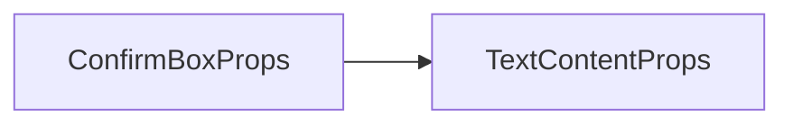

# ConfirmBox 确认框组件 API 文档

本文档由 `DeepSeek R1` 模型生成并微调。

## 组件特性

-   **双选项支持**：是/否选择
-   **灵活样式**：支持图片背景或纯色背景
-   **自动布局**：根据内容动态计算高度
-   **事件驱动**：提供明确的用户选择反馈

---

## Props 属性说明



本组件完全继承 `TextContent` 组件的参数，参考 [组件 TextContent](./组件%20TextContent.md)

| 属性名       | 类型             | 默认值       | 描述               |
| ------------ | ---------------- | ------------ | ------------------ |
| `text`       | `string`         | 必填         | 显示的主文本内容   |
| `width`      | `number`         | 必填         | 确认框宽度（像素） |
| `loc`        | `ElementLocator` | 必填         | 定位配置           |
| `color`      | `CanvasStyle`    | `'#333'`     | 背景颜色           |
| `border`     | `CanvasStyle`    | `'gold'`     | 边框颜色/样式      |
| `selFont`    | `Font`           | 系统默认字体 | 选项按钮字体       |
| `selFill`    | `CanvasStyle`    | `'#d48'`     | 选项按钮文本颜色   |
| `yesText`    | `string`         | `'是'`       | 确认按钮文本       |
| `noText`     | `string`         | `'否'`       | 取消按钮文本       |
| `defaultYes` | `boolean`        | `true`       | 默认选中确认按钮   |

---

## Events 事件说明

| 事件名 | 参数 | 触发时机                    |
| ------ | ---- | --------------------------- |
| `yes`  | -    | 用户选择确认时触发          |
| `no`   | -    | 用户选择取消或按 Esc 时触发 |

---

## 使用示例

### 基础用法 - 文本确认

```tsx
import { defineComponent } from 'vue';

export const MyCom = defineComponent(() => {
    return () => (
        <ConfirmBox
            text="确定要保存当前进度吗？"
            width={208}
            loc={[208, 208, void 0, void 0, 0.5, 0.5]}
            onYes={() => console.log('用户确认保存')}
            onNo={() => console.log('用户取消保存')}
        />
    );
});
```

### 自定义按钮

```tsx
import { defineComponent } from 'vue';
import { Font } from '@motajs/client';

export const MyCom = defineComponent(() => {
    return () => (
        <ConfirmBox
            text="此操作不可逆，是否继续？"
            width={208}
            loc={[208, 208, void 0, void 0, 0.5, 0.5]}
            yesText="确认删除"
            noText="取消操作"
            // 设置选项字体
            selFont={new Font('Verdana')}
            selFill="#f44"
        />
    );
});
```

### 动态内容 + 编程控制

```tsx
import { defineComponent, computed } from 'vue';

export const MyCom = defineComponent(() => {
    const count = ref(0);
    const myText = computed(() => `当前确认次数与取消次数差值：${count.value}`);

    return () => (
        <ConfirmBox
            text={myText.value}
            width={360}
            loc={[208, 208, void 0, void 0, 0.5, 0.5]}
            color="rgba(0,0,0,0.8)"
            border="#4CAF50"
            defaultYes={false}
            onYes={() => void count.value++} // 每次确认次数加一
            onNo={() => void count.value--} // 每次确认次数减一
        />
    );
});
```

## 注意事项

1. **使用更方便的函数**：多数情况下，你不需要使用本组件，使用包装好的函数往往会更加方便，参考 [`getConfirm`](./functions.md#getconfirm)
