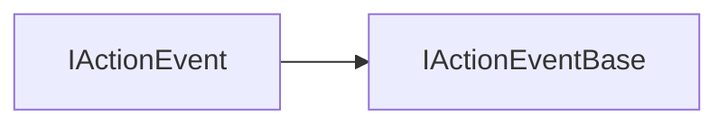
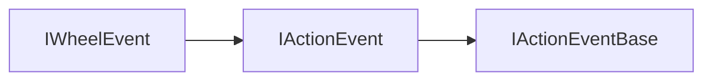

# Event 模块 API 文档

以下内容由 `DeepSeek R1` 模型生成并微调。

---

## 枚举说明

### MouseType

| 值        | 说明             |
| --------- | ---------------- |
| `None`    | 没有按键按下     |
| `Left`    | 左键             |
| `Middle`  | 中键（按下滚轮） |
| `Right`   | 右键             |
| `Back`    | 侧键后退         |
| `Forward` | 侧键前进         |

### WheelType

| 值      | 说明                       |
| ------- | -------------------------- |
| `None`  | 无单位                     |
| `Pixel` | 以像素为单位               |
| `Line`  | 以行为单位（约 1rem）      |
| `Page`  | 以页为单位（一个屏幕高度） |

### ActionType

| 值      | 说明                             |
| ------- | -------------------------------- |
| `Click` | 点击事件（按下与抬起在同一元素） |
| `Down`  | 鼠标或手指按下事件               |
| `Move`  | 鼠标或手指移动事件               |
| `Up`    | 鼠标或手指抬起事件               |
| `Enter` | 进入元素时触发                   |
| `Leave` | 离开元素时触发                   |
| `Wheel` | 滚轮事件                         |

### EventProgress

| 值        | 说明     |
| --------- | -------- |
| `Capture` | 捕获阶段 |
| `Bubble`  | 冒泡阶段 |

---

## 接口说明

### IActionEventBase

| 属性名     | 类型         | 说明                                                              |
| ---------- | ------------ | ----------------------------------------------------------------- |
| `target`   | `RenderItem` | 触发事件的元素                                                    |
| `touch`    | `boolean`    | 是否为触摸操作（`true` 表示触摸，`false` 表示鼠标）               |
| `type`     | `MouseType`  | 触发事件的按键类型（参考 `MouseType`）                            |
| `buttons`  | `number`     | 当前按下的按键（通过位运算判断，例如 `buttons & MouseType.Left`） |
| `altKey`   | `boolean`    | 是否按下 `Alt` 键                                                 |
| `shiftKey` | `boolean`    | 是否按下 `Shift` 键                                               |
| `ctrlKey`  | `boolean`    | 是否按下 `Ctrl` 键                                                |
| `metaKey`  | `boolean`    | 是否按下 `Windows/Command` 键                                     |

---

### IActionEvent

#### 继承关系



| 属性名       | 类型     | 说明                                         |
| ------------ | -------- | -------------------------------------------- |
| `identifier` | `number` | 操作的唯一标识符（在按下、移动、抬起中一致） |
| `offsetX`    | `number` | 相对于元素左上角的横坐标                     |
| `offsetY`    | `number` | 相对于元素左上角的纵坐标                     |
| `absoluteX`  | `number` | 相对于整个画布左上角的横坐标                 |
| `absoluteY`  | `number` | 相对于整个画布左上角的纵坐标                 |

#### 方法说明

##### `stopPropagation`

```typescript
function stopPropagation(): void;
```

**描述**  
停止事件的传播（捕获或冒泡阶段）。

**示例**

```typescript
item.on('click', ev => {
    ev.stopPropagation(); // 阻止事件继续传播
});
```

---

### IWheelEvent



| 属性名      | 类型        | 说明                 |
| ----------- | ----------- | -------------------- |
| `wheelX`    | `number`    | 横向滚动量           |
| `wheelY`    | `number`    | 纵向滚动量           |
| `wheelZ`    | `number`    | 垂直屏幕方向的滚动量 |
| `wheelType` | `WheelType` | 滚动量的单位类型     |

---

### ERenderItemActionEvent

描述了所有的交互事件类型。

| 事件名         | 参数类型                     | 说明               |
| -------------- | ---------------------------- | ------------------ |
| `clickCapture` | `Readonly<IActionEvent>`     | 点击事件的捕获阶段 |
| `click`        | `Readonly<IActionEvent>`     | 点击事件的冒泡阶段 |
| `downCapture`  | `Readonly<IActionEvent>`     | 按下事件的捕获阶段 |
| `down`         | `Readonly<IActionEvent>`     | 按下事件的冒泡阶段 |
| `moveCapture`  | `Readonly<IActionEvent>`     | 移动事件的捕获阶段 |
| `move`         | `Readonly<IActionEvent>`     | 移动事件的冒泡阶段 |
| `upCapture`    | `Readonly<IActionEvent>`     | 抬起事件的捕获阶段 |
| `up`           | `Readonly<IActionEvent>`     | 抬起事件的冒泡阶段 |
| `enter`        | `Readonly<IActionEventBase>` | 进入元素事件       |
| `leave`        | `Readonly<IActionEventBase>` | 离开元素事件       |
| `wheelCapture` | `Readonly<IWheelEvent>`      | 滚轮事件的捕获阶段 |
| `wheel`        | `Readonly<IWheelEvent>`      | 滚轮事件的冒泡阶段 |

---

### ActionEventMap

| 键（ActionType） | 值类型         | 说明         |
| ---------------- | -------------- | ------------ |
| `Click`          | `IActionEvent` | 点击事件     |
| `Down`           | `IActionEvent` | 按下事件     |
| `Enter`          | `IActionEvent` | 进入元素事件 |
| `Leave`          | `IActionEvent` | 离开元素事件 |
| `Move`           | `IActionEvent` | 移动事件     |
| `Up`             | `IActionEvent` | 抬起事件     |
| `Wheel`          | `IWheelEvent`  | 滚轮事件     |

---

## 总使用示例

::: code-group

```typescript
// 创建渲染元素（以 Sprite 为例）
const item = new Sprite();

// 监听点击事件（冒泡阶段）
item.on('click', ev => {
    console.log('点击坐标:', ev.offsetX, ev.offsetY);
    ev.stopPropagation(); // 阻止冒泡
});

// 监听滚轮事件（捕获阶段）
item.on('wheelCapture', ev => {
    console.log('滚轮滚动量:', ev.wheelY, '单位:', WheelType[ev.wheelType]);
});

// 监听进入元素事件
item.on('enter', ev => {
    console.log('进入元素，触发按键:', MouseType[ev.type]);
});
```

```tsx
// 监听点击事件（冒泡阶段）
const click = (ev: IActionEvent) => {
    console.log('点击坐标:', ev.offsetX, ev.offsetY);
    ev.stopPropagation(); // 阻止冒泡
};

// 监听滚轮事件（捕获阶段）
const wheel = (ev: IWheelEvent) => {
    console.log('滚轮滚动量:', ev.wheelY, '单位:', WheelType[ev.wheelType]);
};

// 监听进入元素事件
const enter = (ev: IActionEventBase) => {
    console.log('进入元素，触发按键:', MouseType[ev.type]);
};

<sprite onClick={click} onWheelCapture={wheel} onEnter={enter} />;
```

:::
