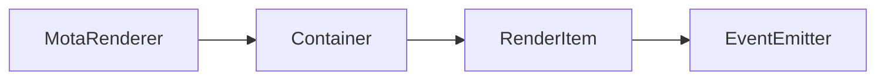

# MotaRenderer 类 API 文档

本文档由 `DeepSeek R1` 模型生成并微调。

---

## 继承关系



---

## 属性说明

| 属性名   | 类型                      | 默认值      | 说明                            |
| -------- | ------------------------- | ----------- | ------------------------------- |
| `isRoot` | `boolean`                 | `true`      | 标识为渲染树根节点              |
| `target` | `MotaOffscreenCanvas2D`   | -           | 绑定的目标画布                  |
| `idMap`  | `Map<string, RenderItem>` | `new Map()` | ID 到渲染元素的映射表（受保护） |

---

## 构造方法

### `constructor`

**参数**

-   `id`: 目标 canvas 元素的 DOM ID（默认为 `render-main`）

**行为**

-   自动绑定指定 ID 的 canvas 元素
-   初始化渲染循环和事件监听
-   设置默认锚点为中心点（0.5, 0.5）

**示例**

```typescript
// 创建主渲染器
const renderer = new MotaRenderer();

// 创建带自定义 ID 的渲染器
const customRenderer = new MotaRenderer('game-canvas');
```

---

## 方法说明

### `getElementById`

```typescript
function getElementById(id: string): RenderItem | null;
```

**描述**  
通过 ID 获取渲染树中的元素。  
**示例**

```typescript
const hero = renderer.getElementById('player');
```

---

### `refresh`

```typescript
function refresh(): void;
```

**描述**  
强制刷新渲染内容（清空画布并重新渲染所有元素）。

---

### `toTagTree`

```typescript
function toTagTree(space?: number): string;
```

**描述**  
（调试用）将渲染树输出为 XML 格式字符串。  
**参数**

-   `space`: 缩进空格数  
    **示例**

```typescript
console.log(renderer.toTagTree());
/* 输出示例：
<MotaRenderer id="render-main" uid="0">
    <Container uid="1">
        <Sprite id="cloud" uid="2" />
    </Container>
</MotaRenderer>
*/
```

---

### `destroy`

```typescript
function destroy(): void;
```

**描述**  
销毁渲染器，释放所有资源并解除事件监听。

---

## 静态方法说明

### `MotaRenderer.get`

```typescript
function get(id: string): MotaRenderer | undefined;
```

**描述**  
通过 ID 获取已注册的渲染器实例。  
**示例**

```typescript
const mainRenderer = MotaRenderer.get('render-main');
```

---

## 总使用示例

```typescript
// 初始化渲染器
const renderer = new MotaRenderer();

// 创建游戏元素
const player = new Sprite();
player.size(32, 32);
player.setRenderFn(canvas => {
    canvas.ctx.fillStyle = 'blue';
    canvas.ctx.fillRect(0, 0, 32, 32);
});

// 添加交互逻辑
player.on('click', ev => {
    console.log('玩家被点击', ev.offsetX, ev.offsetY);
});

// 构建场景
const scene = new Container('absolute');
scene.appendChild(player);
renderer.appendChild(scene);

// 动态查找元素
setTimeout(() => {
    const found = renderer.getElementById('player');
    found?.pos(100, 100);
}, 1000);

// 销毁渲染器（退出时调用）
window.addEventListener('beforeunload', () => {
    renderer.destroy();
});
```
