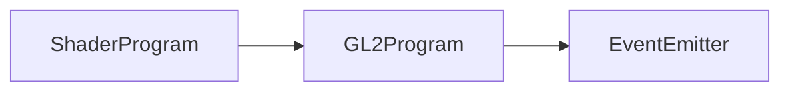

# Shader 类 API 文档

```mermaid
graph LR
    ShaderProgram --> GL2Program --> EventEmitter

    click GL2Program "./GL2Program"
    click EventEmitter "https://nodejs.org/api/events.html#class-eventemitter"
```

用法同 [GL2Program](./GL2Program.md)
