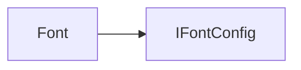

# Font API 文档

本文档由 `DeepSeek R1` 模型生成并微调。

---



_实现 `IFontConfig` 接口，表示字体配置。_

---

## 接口说明

### `IFontConfig`

```typescript
interface IFontConfig {
    family: string; // 字体名称（如 "Arial"）
    size: number; // 字号数值
    sizeUnit: string; // 字号单位（推荐 "px"）
    weight: number; // 字重（0-1000）
    italic: boolean; // 是否斜体
}
```

### `FontWeight` 枚举

```typescript
enum FontWeight {
    Light = 300, // 细体
    Normal = 400, // 常规
    Bold = 700 // 粗体
}
```

---

## 属性说明

| 属性名     | 类型      | 描述                      |
| ---------- | --------- | ------------------------- |
| `family`   | `string`  | 字体家族名称（只读）      |
| `size`     | `number`  | 字号数值（只读）          |
| `sizeUnit` | `string`  | 字号单位（如 "px"，只读） |
| `weight`   | `number`  | 字重数值（只读）          |
| `italic`   | `boolean` | 是否斜体（只读）          |

---

## 构造方法

### `constructor`

```typescript
function constructor(
    family?: string,
    size?: number,
    sizeUnit?: string,
    weight?: number,
    italic?: boolean
): Font;
```

创建字体实例，参数默认使用静态默认值。  
**示例：**

```typescript
const font = new Font('Arial', 14, 'px', FontWeight.Bold, true);
```

---

## 方法说明

### `addFallback`

```typescript
function addFallback(...fallback: Font[]): void;
```

添加后备字体（当主字体不可用时使用）。  
**注意：** 检测到递归添加时会触发 `logger.warn(62)` 警告。  
**示例：**

```typescript
const mainFont = new Font('CustomFont');
const fallback1 = new Font('Arial');
const fallback2 = new Font('Helvetica');
mainFont.addFallback(fallback1, fallback2); // 添加两个后备
```

### `string`

```typescript
function string(): string;
```

生成 CSS 字体字符串，包含后备字体。  
**示例：**

```typescript
console.log(font.string()); // 示例输出："italic 700 14px CustomFont, 400 16px Arial"
```

---

## 静态方法说明

### `Font.parse`

```typescript
function parse(str: string): Font;
```

解析 CSS 字体字符串（支持多字体声明）。  
**示例：**

```typescript
const parsed = Font.parse('italic 16px "Fira Sans", Arial');
// 主字体：Fira Sans，后备：Arial
```

### `Font.setDefaults`

```typescript
function setDefaults(font: Font): void;
```

全局设置默认字体参数。  
**示例：**

```typescript
Font.setDefaults(new Font('Segoe UI', 14, 'px', 400, false));
```

### `Font.clone`

```typescript
function clone(font: Font, options: Partial<IFontConfig>): Font;
```

克隆字体并修改指定属性。  
**示例：**

```typescript
const cloned = Font.clone(baseFont, {
    size: 18,
    weight: FontWeight.Bold
});
```

---

## 总使用示例

```typescript
// 创建主字体
const mainFont = new Font('CustomFont', 16, 'px', FontWeight.Normal);

// 添加后备字体（注意避免循环引用）
const fallbackA = new Font('Arial');
const fallbackB = new Font('Helvetica');
fallbackA.addFallback(fallbackB);
// 错误示例（触发警告62）:
// fallbackB.addFallback(fallbackA);

mainFont.addFallback(fallbackA);

// 生成 CSS 字符串
console.log(mainFont.string());
// 输出: "400 16px CustomFont, 400 16px Arial, 400 16px Helvetica"

// 解析 CSS 字符串
const parsed = Font.parse('italic 700 24px Fantasy, "Comic Sans"');
parsed.addFallback(new Font('Verdana'));

// 克隆并修改
const boldFont = Font.clone(parsed, {
    weight: FontWeight.Bold,
    italic: false
});
```
