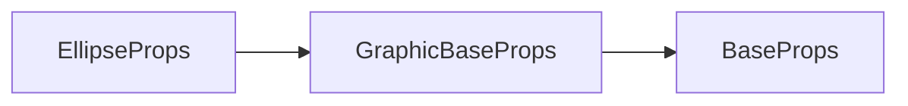

# g-ellipse 标签 API 文档

本文档由 `DeepSeek R1` 模型生成并微调。

---



---

## 接口定义

```typescript
interface EllipseProps extends GraphicBaseProps {
    radiusX?: number; // 椭圆X轴半径
    radiusY?: number; // 椭圆Y轴半径
    start?: number; // 起始角度（单位：弧度）
    end?: number; // 结束角度（单位：弧度）
    ellipse?: EllipseParams; // 简写属性 [x, y, rx, ry, start?, end?]
}
```

---

## 核心属性说明

| 属性      | 类型                           | 默认值 | 说明                                                               |
| --------- | ------------------------------ | ------ | ------------------------------------------------------------------ |
| `radiusX` | `number`                       | -      | 椭圆 X 轴半径（单位：像素）                                        |
| `radiusY` | `number`                       | -      | 椭圆 Y 轴半径（单位：像素）                                        |
| `start`   | `number`                       | `0`    | 起始角度（弧度），0 弧度 = 3 点钟方向                              |
| `end`     | `number`                       | `2π`   | 结束角度（弧度），默认完整椭圆                                     |
| `ellipse` | `[x, y, rx, ry, start?, end?]` | -      | 简写属性：<br>`[圆心x, 圆心y, X半径, Y半径, 起始角度?, 结束角度?]` |

---

## 完整示例集

### 示例 1：基础椭圆（填充）

```tsx
<g-ellipse
    ellipse={[200, 150, 100, 60]} // X轴半径100px Y轴半径60px
    fill // 启用填充
    fillStyle="#a55eea" // 紫色填充
/>
```

---

### 示例 2：描边椭圆

```tsx
<g-ellipse
    ellipse={[400, 300, 80, 40]} // 简写属性 [x,y,rx,ry]
    stroke // 启用描边
    strokeStyle="#2d98da" // 蓝色描边
    strokeWidth={3} // 3px宽描边
    lineDash={[10, 5]} // 虚线样式
/>
```

---

### 示例 3：椭圆弓形（闭合）

```tsx
<g-ellipse
    ellipse={[600, 200, 120, 80, Math.PI / 4, Math.PI * 1.25]}
    fill
    fillStyle="#fd9644" // 橙色填充
/>
```

**角度说明**：

-   绘制方向：**顺时针**（从 45 度到 225 度）
-   自动闭合路径形成扇形
-   若路径自相交，`evenodd` 规则会生成镂空

---

### 示例 4：椭圆弧线（非闭合）

```tsx
<g-ellipse
    ellipse={[300, 400, 150, 50, -Math.PI / 2, Math.PI / 2]} // 从12点到6点
    stroke
    strokeStyle="#eb3b5a" // 红色描边
    strokeWidth={5}
    lineCap="round" // 圆角端点
/>
```

**路径特征**：

-   垂直方向椭圆弧（X 半径 > Y 半径）
-   起始角度：-90 度（12 点方向）
-   结束角度：90 度（6 点方向）
-   开环形成对称弧线

---

## 角度系统详解

### 坐标系与方向

```typescript
// 角度系统与圆形一致，但受半径比例影响：
/*
        radiusY
          ↑
          |
  radiusX +---→ 
*/
```

-   **0 弧度基准**：3 点钟方向（与浏览器 Canvas API 一致）
-   **半径影响**：当 `radiusX ≠ radiusY` 时，相同角度对应的端点位置会拉伸
-   **绘制方向**：角度递增为顺时针方向

### 特殊角度效果

| 参数组合                           | 效果描述                 |
| ---------------------------------- | ------------------------ |
| `radiusX=radiusY`                  | 退化为标准圆形           |
| `start=0, end=Math.PI`             | 右半椭圆（水平方向半圆） |
| `start=Math.PI/2, end=3*Math.PI/2` | 上半椭圆（垂直方向半圆） |

---

## 高级用法示例

### 动态仪表盘

```tsx
import { ref } from 'vue';

const value = ref(0.3);

<g-ellipse
    ellipse={[500, 500, 200, 100]}
    start={-Math.PI / 2 - Math.PI / 4} // 起始角度：-135度（左上方）
    end={-Math.PI / 2 - Math.PI / 4 + value.value * Math.PI * 1.5} // 按比例延伸
    stroke
    strokeStyle="#4b7bec"
    strokeWidth={20}
    lineCap="round"
/>;
```

**效果**：

-   椭圆弧仪表盘，从左上方向右侧延伸
-   进度值 `0.3` 时覆盖 30%路径

---

## 注意事项

1. **简写属性优先级**：

```tsx
// 谁最后被设置用谁的
<g-ellipse
    radiusX={100} // 被覆盖
    ellipse={[200, 200, 150, 80]} // 实际生效 rx=150, ry=80
/>
```
