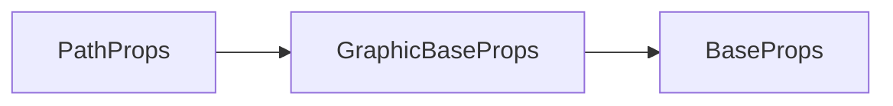

# g-path 标签 API 文档

本文档由 `DeepSeek R1` 模型生成并微调。

---



---

## 接口定义

```typescript
interface PathProps extends GraphicBaseProps {
    path?: Path2D; // 自定义路径对象
}
```

---

## 核心属性说明

| 属性           | 类型                       | 默认值      | 说明                                               |
| -------------- | -------------------------- | ----------- | -------------------------------------------------- |
| `path`         | `Path2D`                   | -           | 自定义矢量路径（支持多路径、贝塞尔曲线等复杂形状） |
| `fillRule`     | `"nonzero"` \| `"evenodd"` | `"evenodd"` | 填充规则（影响路径重叠区域的渲染）                 |
| `actionStroke` | `boolean`                  | `false`     | 设为 `true` 时，交互事件仅检测描边区域             |

---

## 完整示例集

### 示例 1：复杂星形路径

```tsx
// 创建五角星路径
const starPath = new Path2D();
for (let i = 0; i < 5; i++) {
    const angle = (i * 2 * Math.PI) / 5 - Math.PI / 2;
    const x = 100 + Math.cos(angle) * 50;
    const y = 100 + Math.sin(angle) * 50;
    if (i === 0) starPath.moveTo(x, y);
    else starPath.lineTo(x, y);
}
starPath.closePath();

<g-path
    x={200}
    y={200}
    path={starPath}
    fill
    stroke
    fillStyle="#f1c40f"
    fillRule="evenodd" // 使用奇偶环绕原则，使中心镂空
    strokeStyle="#e67e22"
    strokeWidth={3}
/>;
```

**效果说明**：

-   使用`evenodd`规则自动产生星形镂空效果
-   金色填充+橙色描边的五角星

---

### 示例 2：交互式描边检测

```tsx
import { ref } from 'vue';
const [clicked, setClicked] = useState(false);

const clicked = ref(false);

// 创建对话气泡路径
const bubblePath = new Path2D();
bubblePath.moveTo(50, 20);
bubblePath.quadraticCurveTo(25, 0, 0, 20);
bubblePath.quadraticCurveTo(25, 40, 50, 20);
bubblePath.rect(0, 20, 200, 100);

const click = () => void (clicked.value = !click.value);

<g-path
    path={bubblePath}
    fillStyle={clicked.value ? '#ffffff' : '#ecf0f1'}
    strokeStyle="#bdc3c7"
    strokeWidth={2}
    actionStroke // 仅描边区域可交互
    onClick={click}
/>;
```

**交互特性**：

-   点击描边区域切换填充颜色
-   内部区域不响应点击事件

---

### 示例 3：组合路径（齿轮造型）

```tsx
const gearPath = new Path2D();
// 主体圆形
gearPath.arc(100, 100, 80, 0, Math.PI * 2);
// 添加8个齿牙
for (let i = 0; i < 8; i++) {
    const angle = ((Math.PI * 2) / 8) * i;
    gearPath.moveTo(100 + Math.cos(angle) * 90, 100 + Math.sin(angle) * 90);
    gearPath.lineTo(
        100 + Math.cos(angle + Math.PI / 8) * 110,
        100 + Math.sin(angle + Math.PI / 8) * 110
    );
    gearPath.lineTo(
        100 + Math.cos(angle - Math.PI / 8) * 110,
        100 + Math.sin(angle - Math.PI / 8) * 110
    );
}

<g-path
    path={gearPath}
    fill
    stroke
    fillStyle="#2c3e50"
    fillRule="nonzero" // 非零规则填充
    strokeStyle="#34495e"
    strokeWidth={5}
    lineJoin="miter" // 尖角连接
/>;
```

---

## 高级用法示例

### SVG 路径转换

```tsx
// 将SVG路径转换为Path2D
const svgPath = 'M10 80 C 40 10, 65 10, 95 80 S 150 150, 180 80';
const path = new Path2D(svgPath);

<g-path
    path={path}
    stroke
    strokeStyle="#e74c3c"
    strokeWidth={3}
    lineDash={[10, 5]}
    lineCap="round"
/>;
```

---

## 注意事项

1. **路径闭合**：

    ```tsx
    // 必须显式闭合路径才能正确填充
    const path = new Path2D();
    path.moveTo(0, 0);
    path.lineTo(100, 0);
    path.lineTo(100, 100);
    path.closePath(); // 关键闭合操作
    ```
