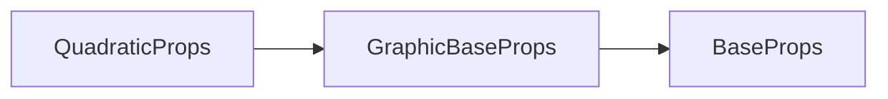

# g-quad 标签 API 文档

本文档由 `DeepSeek R1` 模型生成并微调。

---



---

## 接口定义

```typescript
interface QuadraticProps extends GraphicBaseProps {
    sx?: number; // 起点X坐标
    sy?: number; // 起点Y坐标
    cpx?: number; // 控制点X坐标
    cpy?: number; // 控制点Y坐标
    ex?: number; // 终点X坐标
    ey?: number; // 终点Y坐标
    curve?: QuadParams; // 简写属性 [sx, sy, cpx, cpy, ex, ey]
}
```

---

## 核心属性说明

| 属性    | 类型                         | 默认值 | 说明                                    |
| ------- | ---------------------------- | ------ | --------------------------------------- |
| `sx`    | `number`                     | -      | 曲线起点 X 坐标（单位：像素）           |
| `sy`    | `number`                     | -      | 曲线起点 Y 坐标（单位：像素）           |
| `cpx`   | `number`                     | -      | 控制点 X 坐标（决定曲线弯曲方向和程度） |
| `cpy`   | `number`                     | -      | 控制点 Y 坐标                           |
| `ex`    | `number`                     | -      | 曲线终点 X 坐标                         |
| `ey`    | `number`                     | -      | 曲线终点 Y 坐标                         |
| `curve` | `[sx, sy, cpx, cpy, ex, ey]` | -      | 简写属性：一次性定义全部坐标点          |

---

## 完整示例集

### 示例 1：基础二次贝塞尔曲线

```tsx
<g-quad
    sx={100} // 起点 (100, 300)
    sy={300}
    cpx={300} // 控制点 (300, 100)
    cpy={100}
    ex={500} // 终点 (500, 300)
    ey={300}
    strokeStyle="#2ecc71" // 绿色
    strokeWidth={3}
/>
```

---

### 示例 2：虚线抛物线

```tsx
<g-quad
    curve={[50, 400, 250, 100, 450, 400]} // 简写属性定义
    strokeStyle="#f1c40f" // 黄色
    strokeWidth={2}
    lineDash={[15, 5]} // 长虚线样式
/>
```

**曲线形态**：

-   起点 (50,400) → 控制点 (250,100) → 终点 (450,400)
-   形成对称的类似抛物线形状的曲线

---

## 控制点行为说明

### 控制点影响示意图

```typescript
/*
          (cpx,cpy)
           ●
          / \
         /   \
(start) ●-----●(end)
*/
```

-   **单控制点**：二次贝塞尔曲线仅有一个控制点，同时影响曲线的起始和结束方向
-   **对称性**：控制点距离起点/终点的垂直距离越大，曲线弯曲越明显

### 特殊形态案例

| 控制点布局               | 曲线形态描述  |
| ------------------------ | ------------- |
| 控制点在起点终点连线中点 | 退化为直线    |
| 控制点在起点正上方       | 形成"U"型曲线 |
| 控制点在终点右侧         | 形成"C"型曲线 |

---

## 注意事项

1. **控制点极限值**：  
   当控制点与起点/终点距离过大时可能产生锐角：

```tsx
// 可能产生非预期的尖角形态
<g-quad cpx={sx + 1000} .../>
```
